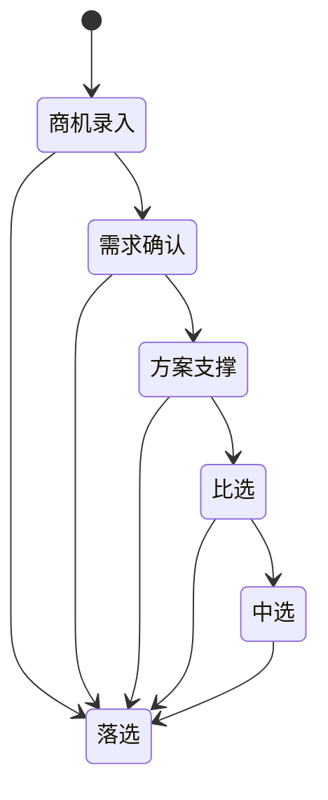
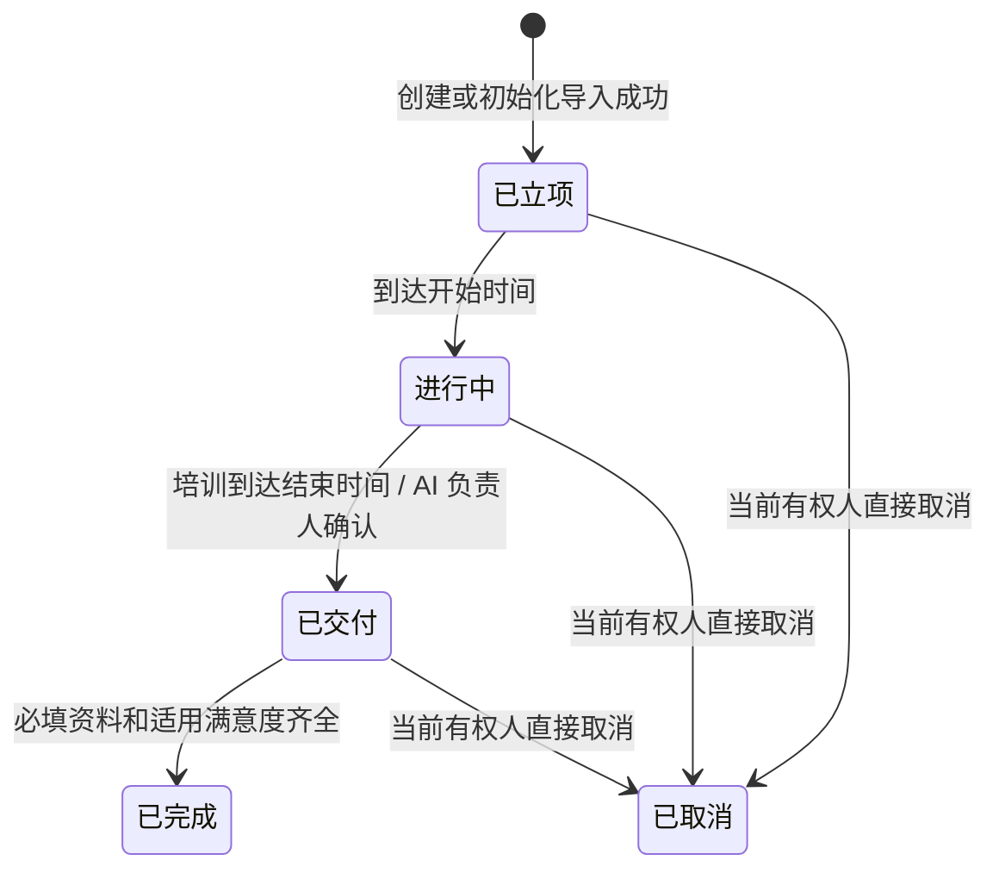
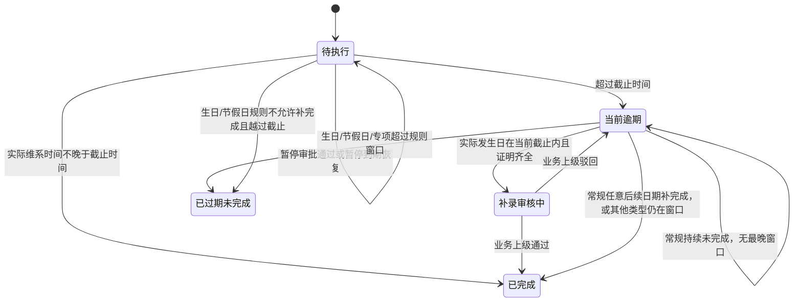

## 附录 B：核心对象与状态机

### 客户与责任关系

```text
行业
└── 集团公司
    ├── 客户公司（显式上级 = 集团）
    └── 客户公司（显式上级 = 同集团客户公司）
        └── 下级客户公司

客户公司业务责任
├── 省级 + 业务责任省 -> 客户负责人及任务执行人：所属区域总监；不设置 PM
├── 市级 + 业务责任省/市 -> 客户负责人：业务责任地市负责人 PM
└── 区县级 + 业务责任省/市/区县 -> 客户负责人：业务责任地市负责人 PM

客户公司 -> 客户部门 -> 标准关键人岗位 -> 关键人当前任职

> Historical / Replaced：此前“集团公司 -> 共享客户部门”模型由 DEC-018 形成，已被 DEC-161/DEC-163 替代。客户部门不得跨客户公司复用。
关键人 -> 维系任务 -> 维系记录
专项 -> 多条专项维系执行项或岗位覆盖 KPI 执行项
客户公司 -> 项目 -> 人员安排 / 项目资料 / 满意度 / 责任历史
客户公司 -> 商机 -> 阶段记录 / 跟进记录 / 方案支撑请求
```

每个客户公司必须属于一个集团，并显式选择所属集团或同集团正常客户公司为组织上级；显式上级稳定 ID 唯一决定当前组织路径。业务责任层级及业务责任省/市/区县不参与组织树归属，只用于解析区域中心、客户负责人、数据权限、任务执行人和项目负责人。页面可以按显式组织树或业务责任区域聚合，但两种视图不得互相改写事实。

### 通用业务状态

| 对象 | 状态 | 说明 |
| --- | --- | --- |
| 员工 | 在职、停用 | HR/admin 停用或恢复不创建审批；有未完成项目时先通过 M08 既有地区责任调整完成项目迁移，否则阻止停用；停用禁止登录，历史工号永久保留，本期无离职状态 |
| 账号 | 启用、停用 | 员工停用使账号立即停用并使会话失效；恢复立即启用，登录临时锁定不是账号状态枚举 |
| 客户/关键人/客户部门 | 正常、已停用 | 业务页面只展示真实业务状态，不展示停用审批中/恢复审批中流程投影；审批进度在 M04/M05 审批上下文查看；停用失败保持正常、恢复失败保持已停用（DEC-184） |
| 任职关系 | 当前有效、已结束 | 同一关键人仅一条当前有效任职 |
| 关键人调岗 | 待接收/审批中、已通过待生效、已通过-业务处理失败、已驳回 | “已通过待生效”是来源业务关联展示，不是新的 M04 通用实例状态；实际生效取审批通过与计划调岗日 00:00 较晚值（DEC-164） |
| 地市交接 | 待审批、已通过待生效、已通过、已驳回、业务处理失败 | 无目标 PM 接收节点；生效前原 PM 继续负责；本期不提供撤回 |
| 专项 | 待开始、进行中、已结束 | 分类为专项维系或关键人覆盖 KPI；不设置草稿状态，正式发布后与唯一父任务按起止时间使用相同生命周期状态，完成结果由任务完成进度表达 |
| 审批实例 | 审批中、已通过、已驳回、已通过-业务处理失败 | 普通审批动作仅提交、通过、驳回；业务处理失败不回退审批意见，后台幂等重试；客户对象受控重试成功前锁定同对象停用/恢复重发 |
| 导入批次 | 已上传、预校验中、待确认、导入中、部分成功、全部成功、失败、已关闭 | 只有待确认可发起正式导入 |
| 项目 | 已立项、进行中、已交付、已完成、已取消 | 五个互斥主阶段；已完成和已取消为终态，已完成仅允许新增可选资料 |
| 项目待办标识 | 资料待上传、待评价、待回款 | 可并行存在，不是项目主阶段；待回款当前不能解除且不阻塞完成 |
| 采购包/平台公司 | 正常、停用 | 不物理删除；停用后退出新项目候选，既有项目使用快照 |
| 商机 | 商机录入、需求确认、方案支撑、比选、中选、落选 | 只允许沿主链逐级前进；任一未落选阶段可进入落选；M12 当前不包含已签约状态 |
| 方案支撑请求 | 待响应、已响应、支撑中、已交付、已关闭 | 每名支撑人员一条独立请求和独立计时；补充退回支撑中，不覆盖既有历史 |

### 商机阶段



“线索”只描述处于商机录入、需求确认等早期阶段的商机，不是独立对象、字段或状态。进入中选必须填写中选日期和预计签约金额；进入落选必须填写落选原因、竞争对手和复盘说明。中选仍可继续跟进，落选为 Current M12 终态。合同与财务能力不在 M12，当前状态集合不得增加已签约。

### 项目阶段



当前取消不经过审批；未来统一审批中心接管前，本状态机不增加取消审批中状态。资料待上传、待评价、待回款独立计算，不得混入主阶段枚举。

### 维系任务状态与完成认定

有效执行任务在同一时点只属于：`已完成`、`待执行/暂停`、`当前逾期`、`补录审核中`、`已过期未完成`。取消和关闭不进入有效集合。常规维系只使用前四类，不允许自动或人工进入“已过期未完成”；生日关怀、节假日关怀和专项维系可按窗口进入该终态。覆盖 KPI 不提交维系记录，也不进入暂停或补录审核中。



- 维系类任务完成认定固定为三种：按期完成（`on_time`）、逾期登记但审批认定按期（`late_entry_approved`）、逾期后补完成（`late_completion`）。覆盖 KPI 使用“系统达标”（内部枚举 `kpi_achieved`），不计入维系类周期总完成率或按期完成率；专项详情另算覆盖 KPI 达标率。业务页面和评审材料只展示中文名称。
- 原截止时间（`originalDueAt`）、实际维系时间（`actualContactAt`）、记录创建时间（`createdAt`）、是否曾逾期（`everOverdue`）和首次逾期时间（`firstOverdueAt`）永久保留。
- 延期审批生效后，完成认定和逾期补录统一以当前截止时间（`currentDueAt`）判断：实际维系时间不晚于当前截止但系统登记发生在逾期后，进入逾期补录；实际维系时间晚于当前截止，进入逾期补完成。原截止时间只用于展示延期历史和审计，不继续作为完成认定边界。
- 已参与完成认定的记录不得修改关键人、维系时间或关联任务。
- 覆盖 KPI 在截止前达到目标时进入已完成，低于目标时回到待执行；超过截止仍未达标时进入当前逾期，专项结束且不再允许变化时进入已过期未完成。达标快照永久保留，重新打开不删除此前达标时间和分子/分母。
- 常规维系不设置补完成截止，当前截止之后任意日期仍允许逾期补完成并持续保持当前逾期；生日和节假日任务固定不允许逾期补完成，越过当前截止即记录曾经逾期并进入已过期未完成；专项维系按发布快照决定是否允许及明确截止日期。仅对存在补完成截止的任务，窗口从当前截止时间起算，延期审批改变当前截止时同步重算尚未过期任务的补完成截止并记录前后值。业务时间统一精确到秒：服务端收到请求的业务时间小于或等于补完成截止秒时允许提交，从下一秒开始拒绝并进入已过期未完成；服务端以收到请求时按附录 A 规范化后的时间校验，不信任前端时间。
