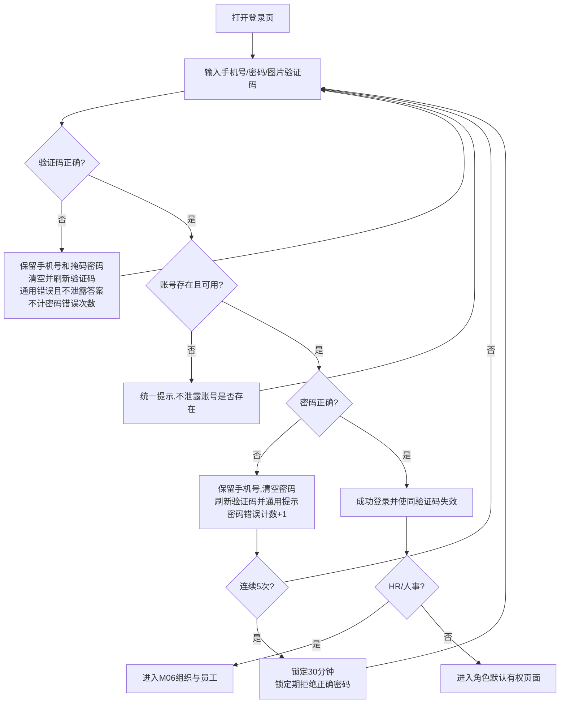

# FLOW-01 P00-login

> 正式产品登录规则继续按本文验收/流程执行；Demo 自动预填验证码的唯一约定见 [`prd-workspace/current/modules/P00-login.md`](../modules/P00-login.md) → “Demo 登录演示约定”，不以 Demo 预填替代正式产品安全要求。

- 原始行：239
- 原始最近标题：按钮与交互说明
- 迁移方式：Mermaid block mechanical copy
- 当前定位：Current Mechanical Evidence；登录、统一失败反馈、失败计数和锁定分支继续有效，详细账号与密码事实由 P00/Shared/Decision 拥有

HR/人事从任一无权页面执行返回时也进入 M06“组织与员工”，不回到无权的 M01 工作台。
