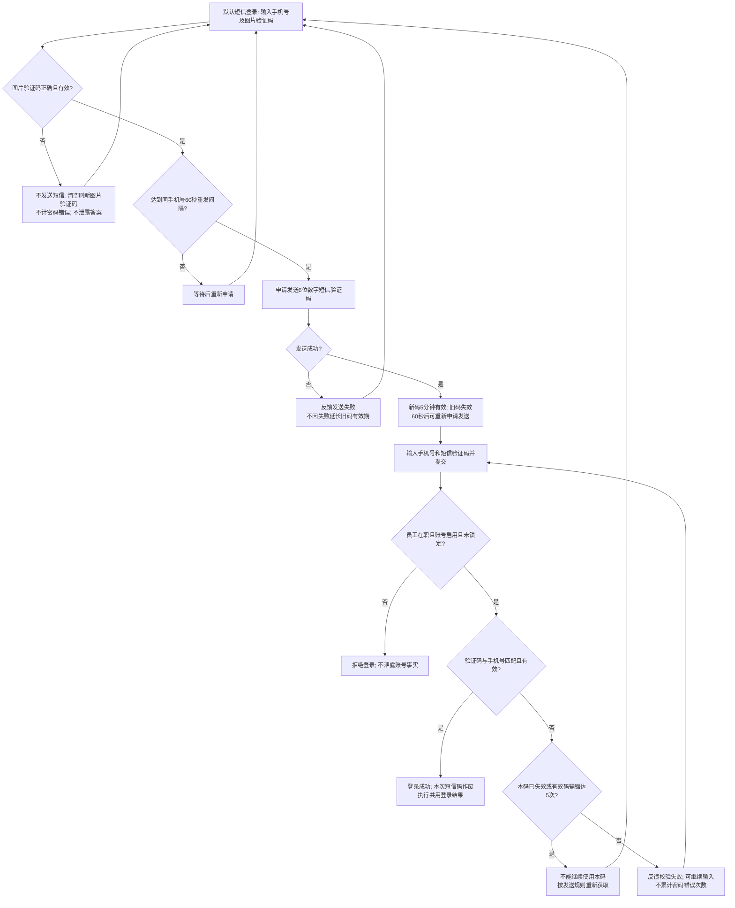
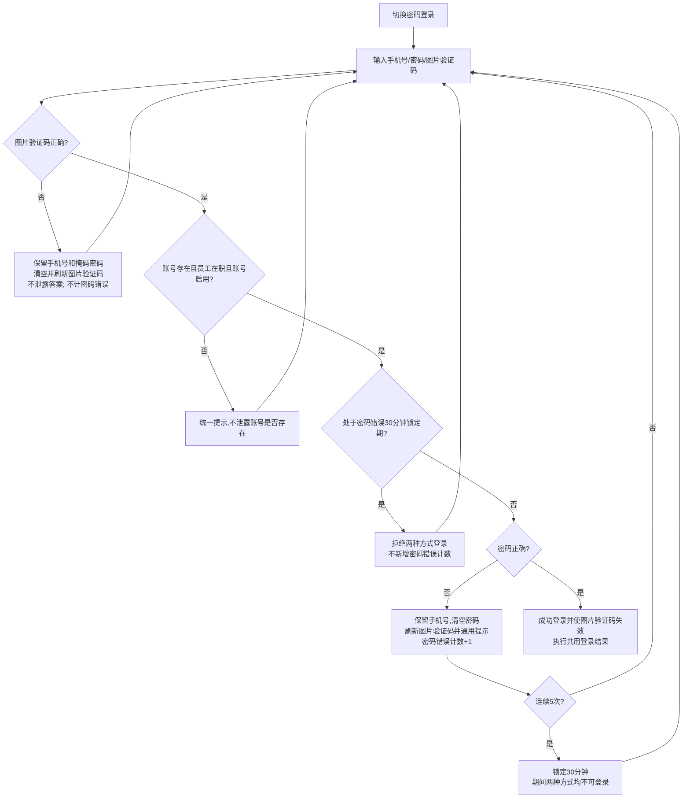

# FLOW-01 P00-login

> 当前规则由 [`prd-workspace/current/modules/P00-login.md`](../modules/P00-login.md) → “关键登录规则”和 [`DEC-216`](../../decisions/DEC-216-短信验证码登录与双方式锁定.md) → “当前决定”拥有。已有Demo的图片验证码预填仅用于密码登录演示，不替代短信登录验收。

## 入口与共用结果

打开登录页默认短信验证码登录，可切换密码登录。两种方式使用同一员工账号及当前手机号；员工停用、账号停用或密码错误触发的30分钟锁定均不能登录。切换方式不绕过锁定、短信重发间隔或验证码失效。

登录成功均更新最近登录、清零连续密码错误次数，按角色进入默认有权页面，HR/人事进入M06组织与员工。两种方式适用相同的闲置30分钟/单次12小时会话时限。HR/人事从无权页面返回也进入M06，不回到无权M01。

## 短信验证码登录流程

```mermaid
flowchart TD
    A[默认短信登录: 输入手机号及图片验证码] --> B{图片验证码正确且有效?}
    B -- 否 --> B1[不发送短信; 清空刷新图片验证码<br/>不计密码错误; 不泄露答案] --> A
    B -- 是 --> C{达到同手机号60秒重发间隔?}
    C -- 否 --> C1[等待后重新申请] --> A
    C -- 是 --> D[申请发送6位数字短信验证码]
    D --> E{发送成功?}
    E -- 否 --> E1[反馈发送失败<br/>不因失败延长旧码有效期] --> A
    E -- 是 --> F[新码5分钟有效; 旧码失效<br/>60秒后可重新申请发送]
    F --> G[输入手机号和短信验证码并提交]
    G --> H{员工在职且账号启用且未锁定?}
    H -- 否 --> H1[拒绝登录; 不泄露账号事实]
    H -- 是 --> I{验证码与手机号匹配且有效?}
    I -- 是 --> J[登录成功; 本次短信码作废<br/>执行共用登录结果]
    I -- 否 --> K{本码已失效或有效码输错达5次?}
    K -- 是 --> K1[不能继续使用本码<br/>按发送规则重新获取] --> A
    K -- 否 --> K2[反馈校验失败; 可继续输入<br/>不累计密码错误次数] --> G
```

任一码在重发成功、有效期届满、输错5次或成功登录后不可继续使用。获取后账号被停用或锁定，同样在登录提交时拒绝。

## 密码登录流程

```mermaid
flowchart TD
    A[切换密码登录] --> B[输入手机号/密码/图片验证码]
    B --> C{图片验证码正确?}
    C -- 否 --> C1[保留手机号和掩码密码<br/>清空并刷新图片验证码<br/>不泄露答案; 不计密码错误] --> B
    C -- 是 --> D{账号存在且员工在职且账号启用?}
    D -- 否 --> D1[统一提示,不泄露账号是否存在] --> B
    D -- 是 --> L{处于密码错误30分钟锁定期?}
    L -- 是 --> L1[拒绝两种方式登录<br/>不新增密码错误计数] --> B
    L -- 否 --> E{密码正确?}
    E -- 否 --> F[保留手机号,清空密码<br/>刷新图片验证码并通用提示<br/>密码错误计数+1]
    F --> G{连续5次?}
    G -- 否 --> B
    G -- 是 --> H[锁定30分钟<br/>期间两种方式均不可登录] --> B
    E -- 是 --> I[成功登录并使图片验证码失效<br/>执行共用登录结果]
```

验收入口：[`prd-workspace/current/acceptance/M06.md`](../acceptance/M06.md) → AC-F001-20、AC-F001-31及AC-F001-65至AC-F001-70。其他密码失败交互沿用AC-F001-32、AC-F001-33、AC-F001-43、AC-F001-44、AC-F001-60。
