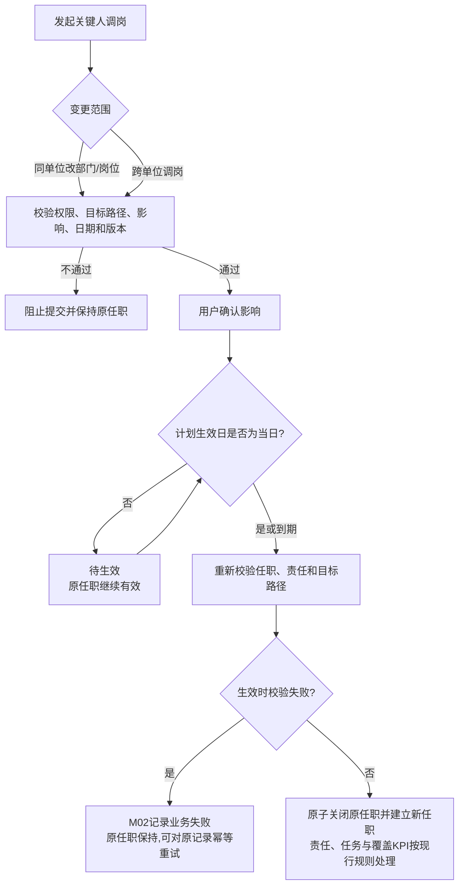

# FLOW-02 M02-key-contact-transfer

- 原始行：569
- 原始最近标题：关键字段通俗释义
- 迁移方式：Mermaid block mechanical copy
- 当前定位：Current Product Flow；DEC-204 取消目标 PM 接收和所有上级审批，保留计划调岗日、任职原子衔接和到期重新校验

```mermaid
flowchart TD
    A[发起关键人调岗] --> B{变更范围}
    B -- 同单位改部门/岗位 --> C[校验权限、目标路径、影响、日期和版本]
    B -- 跨单位调岗 --> C
    C -- 不通过 --> D[阻止提交并保持原任职]
    C -- 通过 --> E[用户确认影响]
    E --> J{计划生效日是否为当日?}
    J -- 否 --> K[待生效<br/>原任职继续有效]
    K --> J
    J -- 是或到期 --> L[重新校验任职、责任和目标路径]
    L --> M{生效时校验失败?}
    M -- 是 --> N[M02记录业务失败<br/>原任职保持,可对原记录幂等重试]
    M -- 否 --> O[原子关闭原任职并建立新任职<br/>责任、任务与覆盖KPI按现行规则处理]
```
