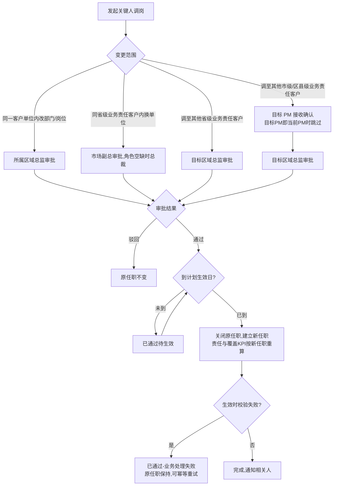

# FLOW-02 M02-key-contact-transfer

- 原始行：569
- 原始最近标题：关键字段通俗释义
- 迁移方式：Mermaid block mechanical copy
- 当前定位：Current Product Flow；DEC-164 确认关键人调岗实际生效取审批通过时刻与计划调岗日 00:00 的较晚值，等待期间展示“已通过待生效”，并在履历保留计划调岗日；DEC-187 移除撤回

