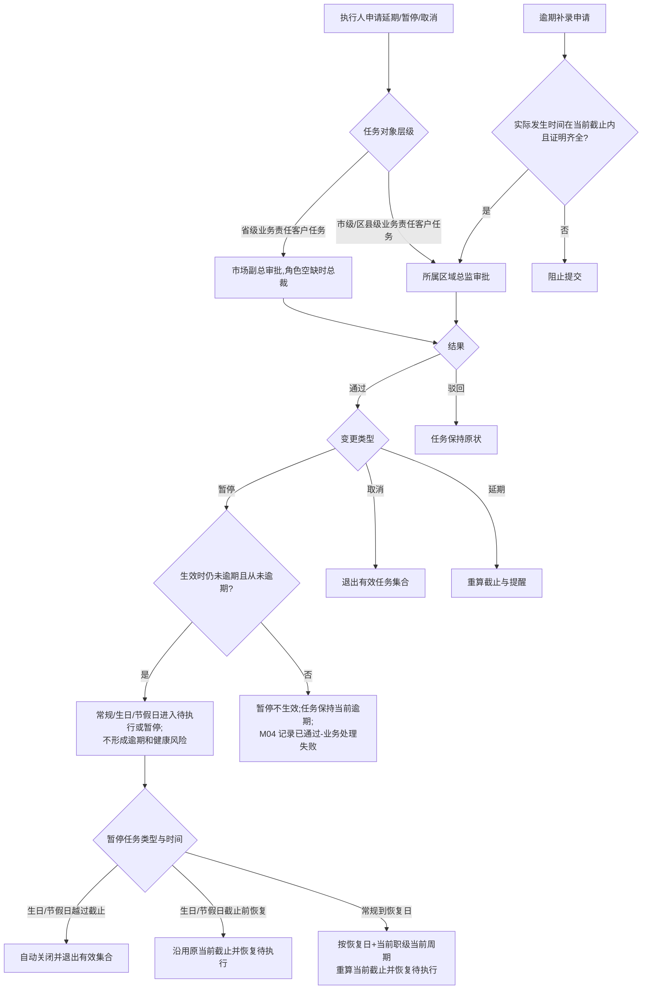

# FLOW-03 M03-task-exception

- 原始行：861
- 原始最近标题：关键字段通俗释义
- 迁移方式：Mermaid block mechanical copy
- 当前定位：Current Product Flow；省级业务责任客户异常/逾期补录上提市场副总，角色空缺或继续上提时由总裁处理；市级/区县级业务责任客户由所属区域总监处理；DEC-187 移除撤回；暂停资格、生效复核、恢复和节令越期关闭按 DEC-200（DEC-163、DEC-180、DEC-200）

