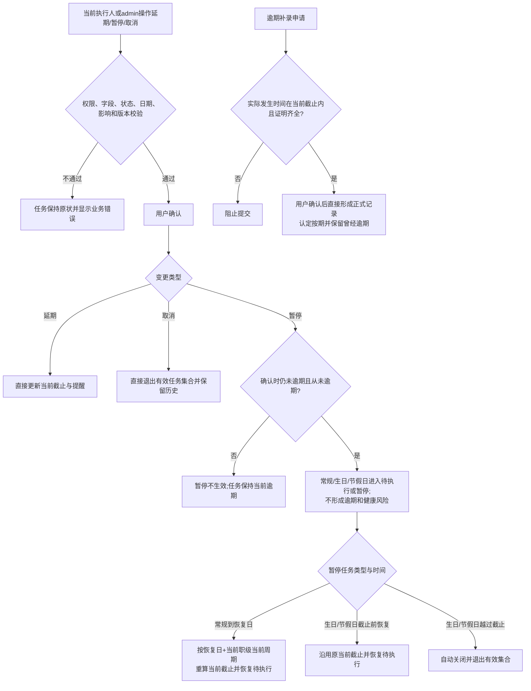

# FLOW-03 M03-task-exception

- 原始行：861
- 原始最近标题：关键字段通俗释义
- 迁移方式：Mermaid block mechanical copy
- 当前定位：Current Product Flow；DEC-204 取消异常与逾期补录审批，保留 M03 原权限、字段、状态、日期、影响、并发和暂停资格校验；暂停恢复与节令越期关闭按 DEC-200

