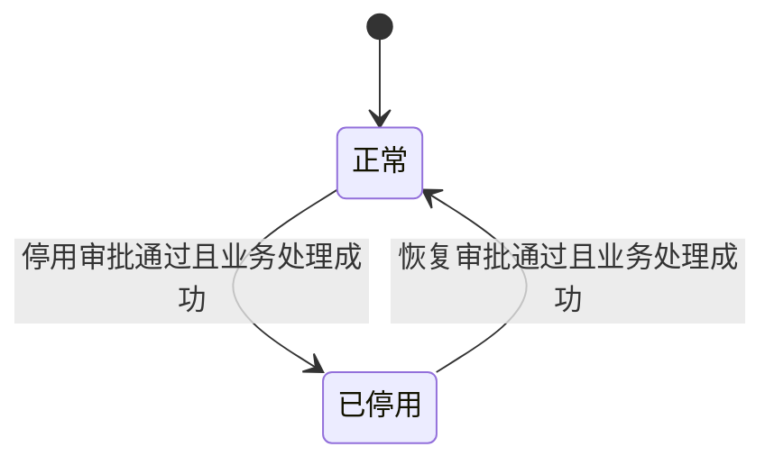

# FLOW-04 M05-deactivation-lifecycle

- 原始行：1034
- 原始最近标题：状态流转
- 迁移方式：Mermaid block mechanical copy
- 当前定位：Current Product Flow；DEC-184 已移除业务对象上的停用审批中/恢复审批中流程投影。业务对象只展示正常/已停用，审批进度及业务处理失败由 M04/M05 审批上下文展示

- 提交停用到生效前，对象保持并只展示正常；驳回、撤回或停用业务处理失败也保持正常。
- 提交恢复到生效前，对象保持并只展示已停用；驳回、撤回或恢复业务处理失败也保持已停用。
- `审批中` 与 `已通过-业务处理失败` 是 M04 审批实例状态，不投影为对象业务状态。
- 业务处理失败时通知 admin；受控重试成功前锁定同一对象停用/恢复重复发起，不创建第二审批实例。
