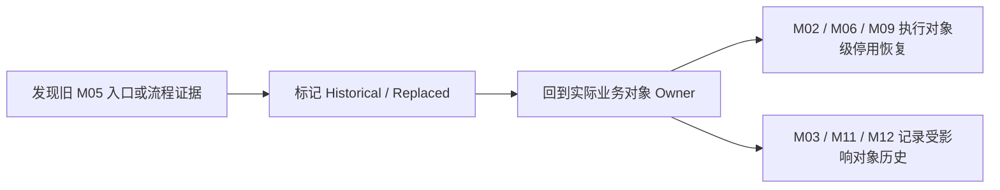

# FLOW-04 M05-deactivation-lifecycle（已移除）

## REMOVED Current Boundary

M05 不存在当前生命周期。任一角色均无 M05 菜单、页面、直接路由或权限；旧流程图不得作为研发输入。

当前业务操作的权限、影响校验、二次确认、直接生效、失败保护、恢复顺序和历史均由实际业务对象 Owner 定义。M05 编号保留，但不承载产品能力。

精确依据：[`DEC-207《取消独立停用记录并由业务所有者保留历史》`](../../decisions/DEC-207-取消独立停用记录并由业务所有者保留历史.md) -> “决策”。
