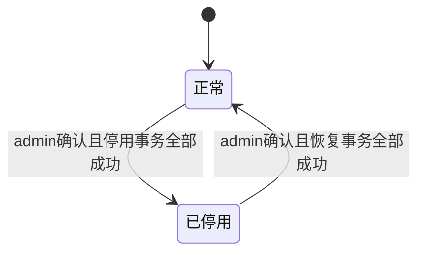

# FLOW-04 M05-deactivation-lifecycle

- 原始行：1034
- 原始最近标题：状态流转
- 迁移方式：Mermaid block mechanical copy
- 当前定位：Current Product Flow；DEC-184 保留业务对象只展示正常/已停用，DEC-198 将客户侧停用/恢复改为仅 `admin` 校验并二次确认后直接生效

- admin 完成影响校验并二次确认前，对象保持并只展示原业务状态；取消确认不产生停用/恢复记录。
- 停用或恢复事务任一写入失败时整次操作不生效：停用失败保持正常，恢复失败保持已停用，不留下部分对象或部分任务处理结果。
- 客户侧停用/恢复不创建 M04 审批实例、流程编号、审批待办、抄送或业务回调重试链路。
- M05 保存成功操作的对象快照、影响结果、原因、实际操作人、生效时间和完整历史。
