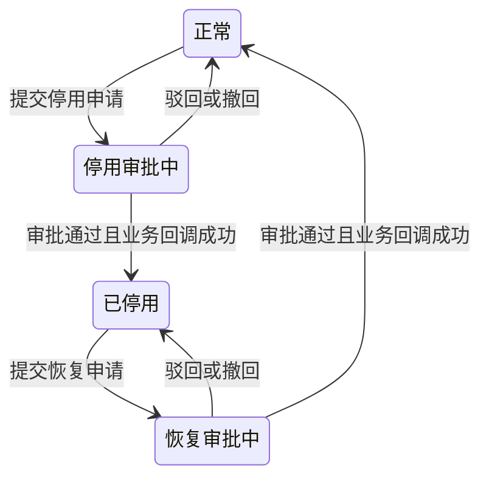

# FLOW-04 M05-deactivation-lifecycle

- 原始行：1034
- 原始最近标题：状态流转
- 迁移方式：Mermaid block mechanical copy
- 当前定位：Mechanical Migration Evidence；图中“停用审批中/恢复审批中”按关联流程投影读取，不是 M09 客户主数据的持久业务状态。M09 业务状态仅为正常/已停用，审批实例状态由 M04 拥有

