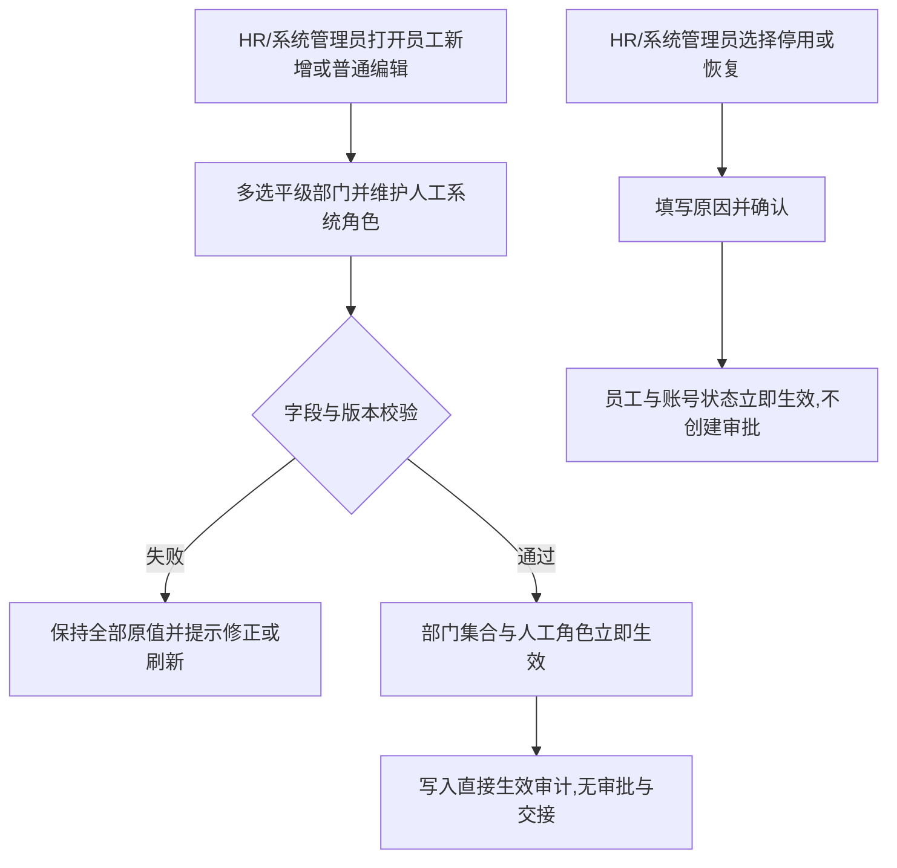

# FLOW-05 M06-employee-change

- 原始行：1320
- 原始最近标题：关键字段通俗释义
- 迁移方式：Mermaid block mechanical copy
- 当前定位：Current Mechanical Evidence；DEC-165 已将旧调岗/移动容器及员工停用/恢复审批分支替代为 M06 普通编辑和直接状态操作

> Historical / Replaced Evidence：原机械迁移图中的“员工调岗/移动 -> 责任交接 -> 影响摘要 -> 二次确认”和“员工停用/恢复 -> 部门主管链审批”已由 DEC-165 替代，不再作为 Current Rule。
