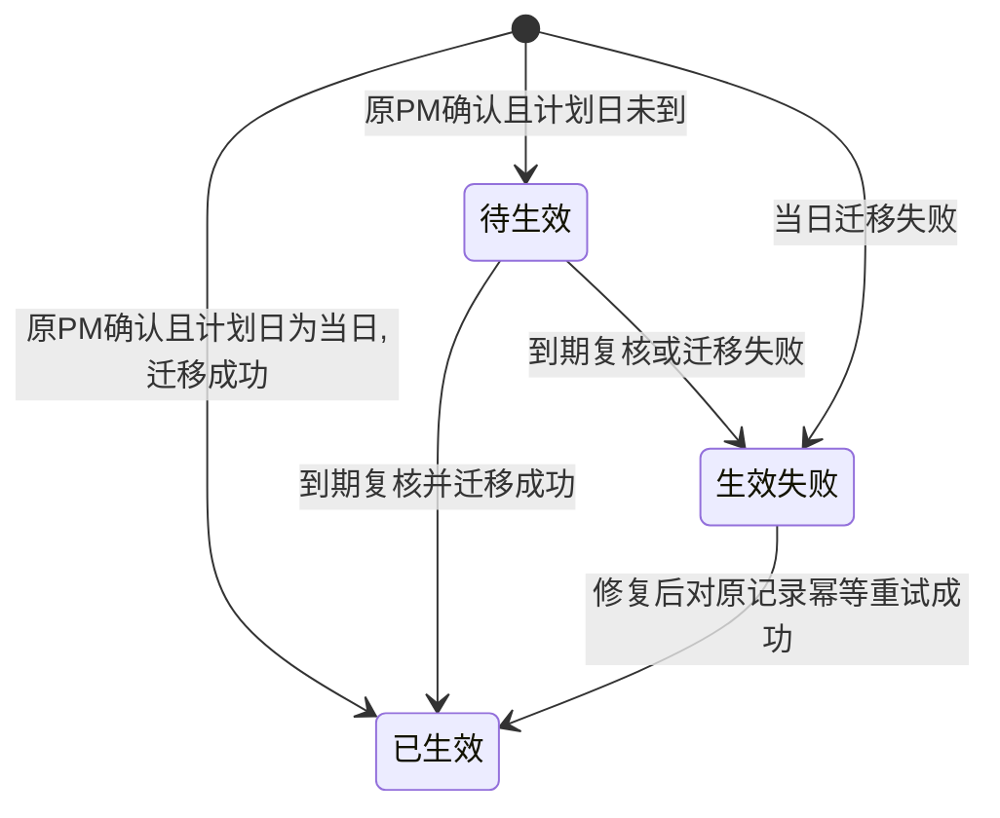

# FLOW-06 M08-city-handover

- 原始行：1499
- 原始最近标题：交接申请字段与流程
- 迁移方式：Mermaid block mechanical copy
- 当前定位：Current Product Flow；DEC-143 仅允许原负责 PM 发起普通交接，DEC-204 取消区域总监审批；M08 的分配/直接调整是独立受控动作

> Historical / Replaced：本 Flow 旧图包含区域总监/admin 普通交接发起、待审批、已驳回、已撤回和审批回调失败。当前普通交接仅原负责 PM 发起，不提供接收、审批或撤回；旧图只用于 Git/Archive 追溯。

> DEC-209 补充：普通 PM 地市交接/直接调整的影响确认与生效迁移包含责任地市全部未落选商机，并记录来源责任变更。任一适用任务、项目或商机迁移失败，整体保持原值；已落选商机和历史月份目标不改写。详见 [`prd-workspace/current/modules/M08-region.md`](../modules/M08-region.md) → “4.9 PM 地市责任与商机同步”。
