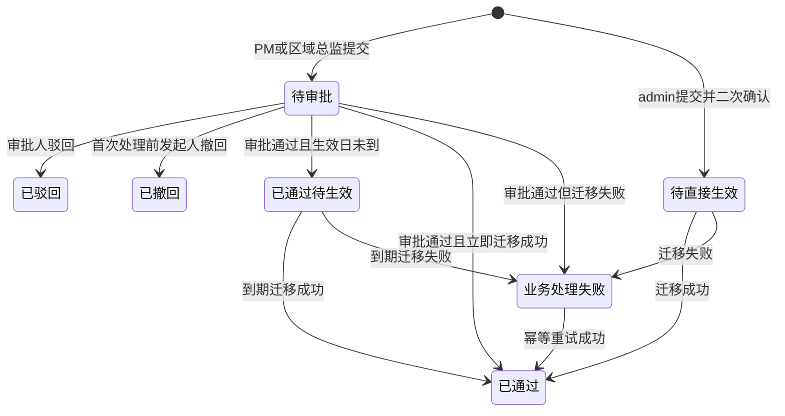

# FLOW-06 M08-city-handover

- 原始行：1499
- 原始最近标题：交接申请字段与流程
- 迁移方式：Mermaid block mechanical copy
- 当前定位：Historical / Replaced Evidence；普通交接中区域总监/admin 发起与直接生效分支已被 DEC-143/FLOW-10 替代。Current Rule 仅允许原负责 PM 发起普通交接，由所属区域总监审批；M08 的分配/直接调整是独立受控动作

