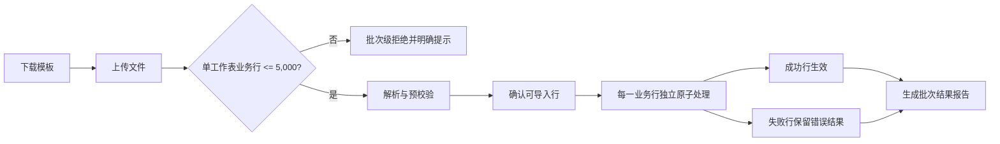
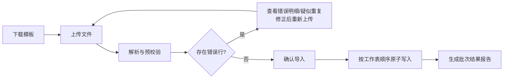

# FLOW-07 M10-import

- 原始行：1997
- 原始最近标题：按钮与交互说明
- 迁移方式：Mermaid block mechanical copy
- 当前定位：Current Product Flow 使用下方 Current 分支；原机械迁移块保留为 Historical / Replaced Evidence（DEC-163）

## Current Product Flow

100 行允许形成 80 行成功、20 行失败；失败行不回滚其他成功行。一行内对应业务对象不得形成产品事实半成品。

## Historical / Replaced Evidence

以下机械迁移块原样保留；“按工作表顺序原子写入”不得再解释为工作表整体原子。

