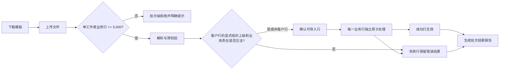
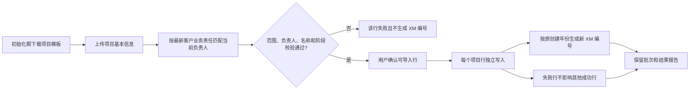
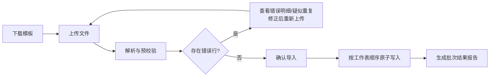

# FLOW-07 M10-import

- 原始行：1997
- 原始最近标题：按钮与交互说明
- 迁移方式：Mermaid block mechanical copy
- 当前定位：Current Product Flow 使用下方 Current 分支；原机械迁移块保留为 Historical / Replaced Evidence（DEC-163）

## Current Product Flow

100 行允许形成 80 行成功、20 行失败；失败行不回滚其他成功行。一行内对应业务对象不得形成产品事实半成品。

## 项目初始化导入分支

- admin 导入公司范围项目；区域总监只导入本人负责省级业务责任客户项目；PM 只导入本人负责市级/区县级业务责任客户项目。
- 项目导入只新增，不覆盖既有项目，不允许导入`已取消`项目；历史`已完成`但完成条件不齐时按`已交付`建立并展示缺项待办。
- 初始化完成后隐藏项目模板并拒绝新上传，历史批次和报告继续按权限保留。
- 区域总监导入本人负责省级业务责任客户关键人是独立且长期开放的分支，不随项目初始化导入关闭，也不扩大到市级/区县级业务责任客户关键人。

## Historical / Replaced Evidence

以下机械迁移块原样保留；“按工作表顺序原子写入”不得再解释为工作表整体原子。

