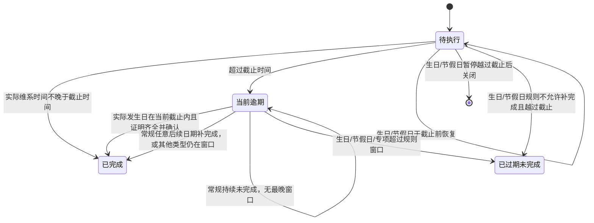

# FLOW-08 shared-maintenance-state

- 原始行：2178
- 原始最近标题：维系任务状态与完成认定
- 迁移方式：Mermaid block mechanical copy
- 当前定位：Current Mechanical Evidence；DEC-204 删除`补录审核中`，逾期补录校验成功后直接完成；未暂停的生日/节假日越过截止后进入已过期未完成，暂停中的生日/节假日按 DEC-200 越过截止后自动关闭并退出有效集合。

