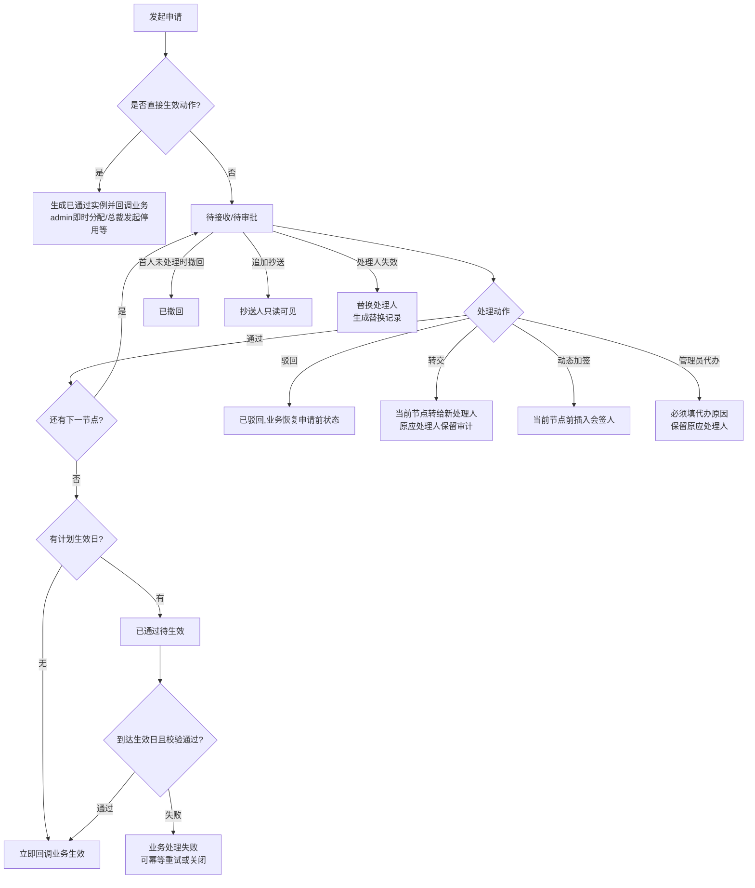

# FLOW-09 M04-approval-lifecycle

- 原始行：2526
- 原始最近标题：F1 通用审批实例生命周期与动作
- 迁移方式：Mermaid block mechanical copy
- 当前定位：主体为 Current Mechanical Evidence；`业务处理失败 -> 可关闭` 分支为 Historical / Replaced。Current Rule 保持审批结论“已通过”，业务对象可保持原状态，仅 admin 接收提醒并执行受控重试，不新建审批、不形成普通业务待办、不改为驳回（DEC-163）。

