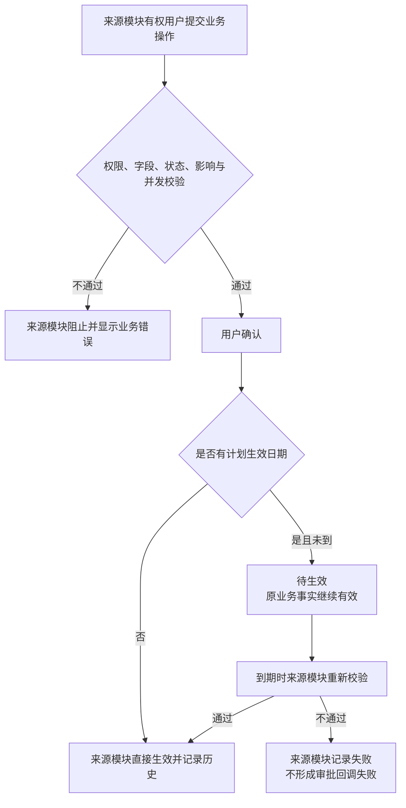

# FLOW-09 M04 approval lifecycle

## Current Boundary

M04 审批中心为 `NOT REVIEWED / NOT STARTED / DEFERRED`，当前没有可执行的审批生命周期。各来源模块按 DEC-204 直接或按计划日期生效：

本 Flow 不定义未来审批中心的节点、状态、人员或操作。历史版本可通过 Git/Archive 用于追溯，但不是 Current Product Rule。

精确来源：`DEC-204《当前业务操作取消审批并由来源模块生效》`，见 [`prd-workspace/decisions/DEC-204-当前业务操作取消审批并由来源模块生效.md`](../../decisions/DEC-204-当前业务操作取消审批并由来源模块生效.md) → “决策”第 1-12 项。
