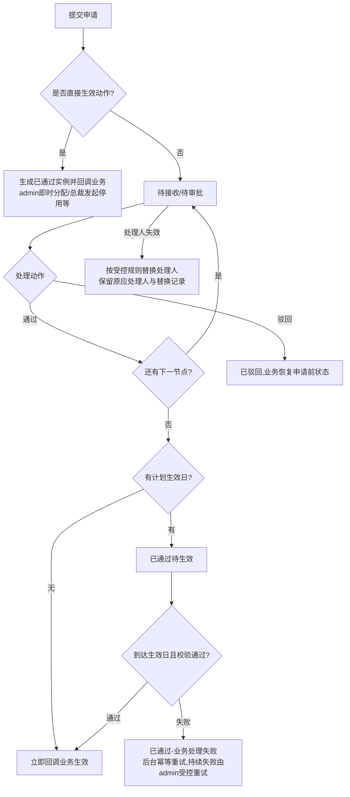

# FLOW-09 M04-approval-lifecycle

- 原始行：2526
- 原始最近标题：F1 通用审批实例生命周期与动作
- 迁移方式：Mermaid block mechanical copy
- 当前定位：Current Product Flow；普通审批动作仅提交、通过、驳回；预设会签、提交时预设抄送、回调重试与失效处理人受控替换继续有效（DEC-163、DEC-187）。

