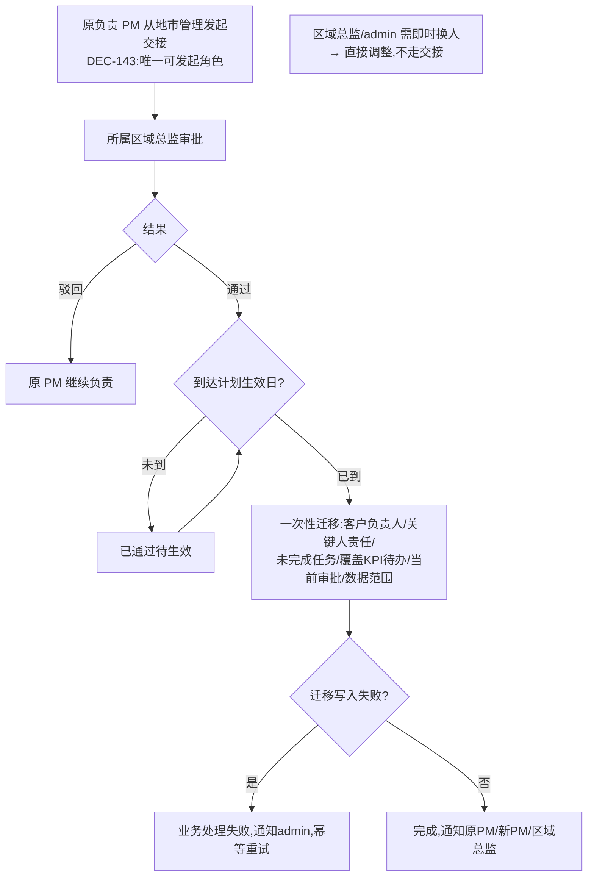

# FLOW-10 M08-city-handover-approval

- 原始行：2551
- 原始最近标题：F2 地市负责人交接
- 迁移方式：Mermaid block mechanical copy
- 当前定位：Current Product Flow；原负责 PM 从“地市管理”发起普通交接，所属区域总监审批，计划日到达后迁移；业务处理失败时审批结论仍为已通过，仅 admin 接收提醒并受控重试（DEC-143/DEC-163/DEC-173）

本期不提供地市交接撤回；已提交申请仅继续审批或查看结果。
