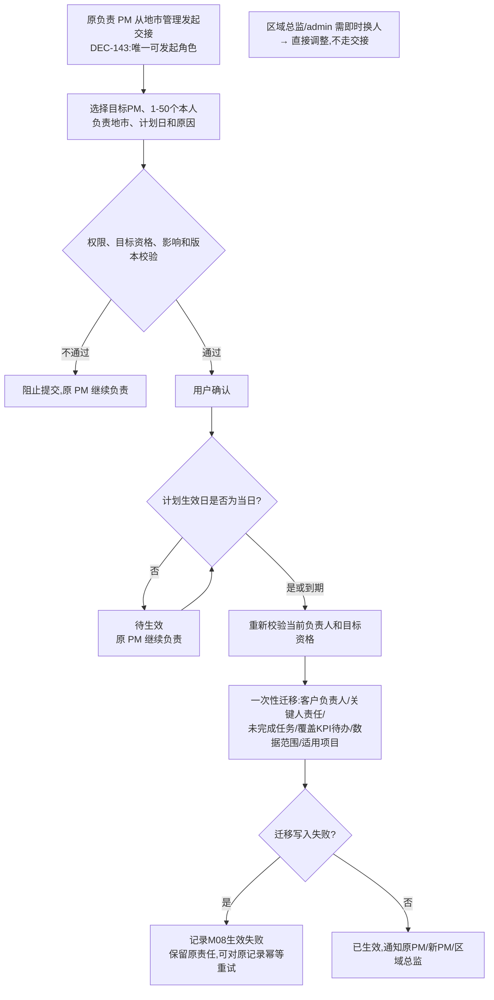

# FLOW-10 M08-city-handover-approval

- 原始行：2551
- 原始最近标题：F2 地市负责人交接
- 迁移方式：Mermaid block mechanical copy
- 当前定位：Current Product Flow；文件名为历史兼容标识。原负责 PM 从“地市管理”发起普通交接，确认后直接或待生效，不创建区域总监审批（DEC-143/DEC-173/DEC-204）

本期不提供地市交接撤回、目标 PM 接收或上级审批；未来日期的交接仅查看`待生效`及最终生效结果。
