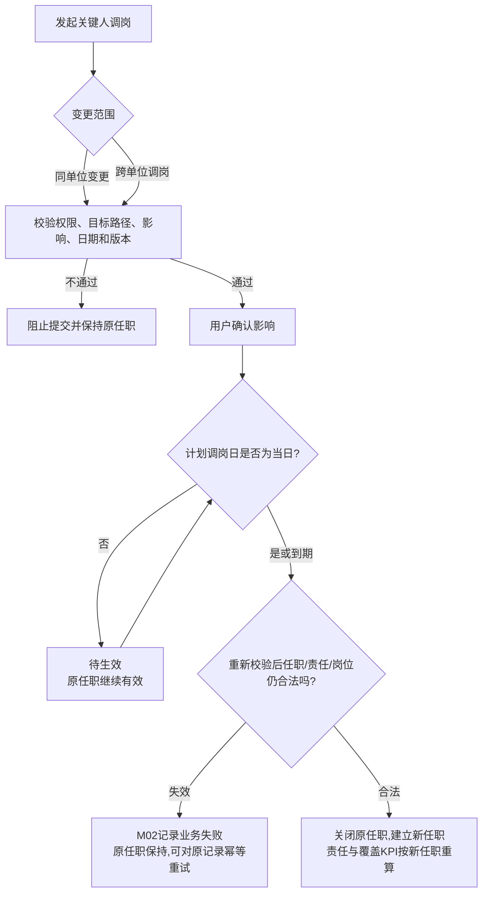

# FLOW-11 M02-key-contact-transfer-approval

- 原始行：2568
- 原始最近标题：F3 关键人调岗
- 迁移方式：Mermaid block mechanical copy
- 当前定位：Current Product Flow；文件名为历史兼容标识。DEC-204 已取消关键人调岗的目标 PM 接收和所有上级审批，当前只表达直接/待生效业务流程。

> Historical / Replaced：本文件旧机械块曾包含目标 PM 接收、上级审批、驳回和`已通过-业务处理失败`。这些语义已被 DEC-204 替代；旧表达只用于 Git/Archive 追溯，不再作为 Current Rule。
