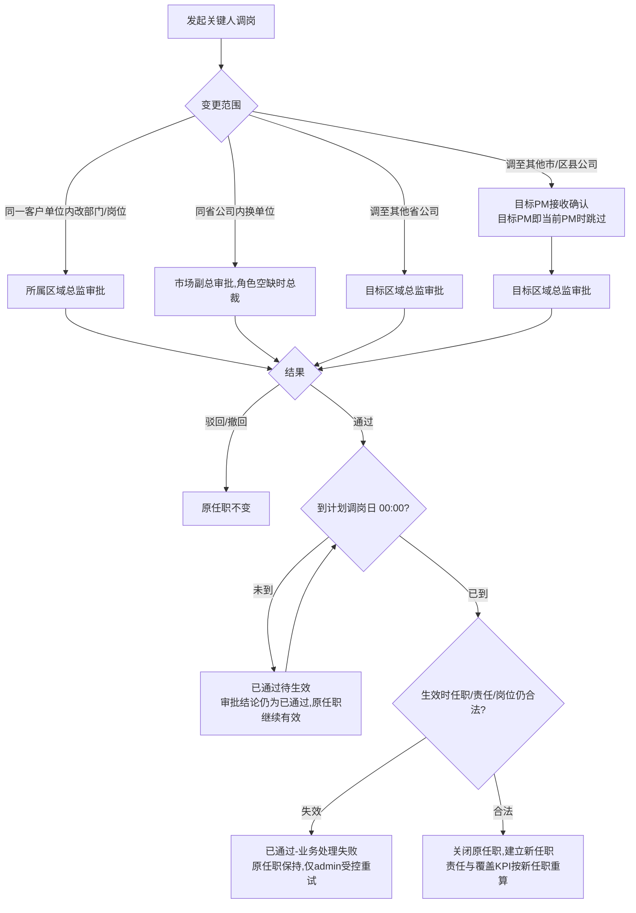

# FLOW-11 M02-key-contact-transfer-approval

- 原始行：2568
- 原始最近标题：F3 关键人调岗
- 迁移方式：Mermaid block mechanical copy
- 当前定位：Current Mechanical Evidence；DEC-164 确认关键人调岗实际生效取审批通过时刻与计划调岗日 00:00 的较晚值，等待期间展示“已通过待生效”。业务失败时审批结论仍为已通过，只允许 admin 受控重试。

> Historical / Replaced：本 Flow 旧机械块在审批通过后直接进入生效校验，且失败分支包含 `admin关闭`。DEC-163 已替代关闭动作，DEC-164 已补齐计划调岗日等待分支；旧表达只用于追溯，不再作为 Current Rule。
