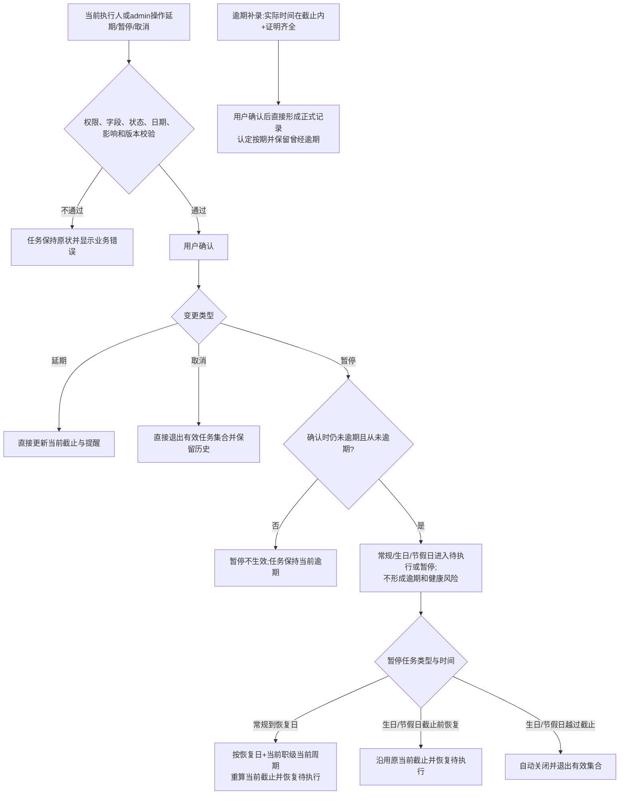

# FLOW-12 M03-task-exception-approval

- 原始行：2588
- 原始最近标题：F4 任务异常与逾期补录
- 迁移方式：Mermaid block mechanical copy
- 当前定位：Current Product Flow；文件名为历史兼容标识。DEC-204 已取消任务异常与逾期补录审批，当前只表达 M03 校验确认后的直接生效流程。

> Historical / Replaced：本文件旧 Current 内容包含区域总监、市场副总或总裁审批，以及`已通过-业务处理失败`。这些语义已被 DEC-204 替代；旧内容只用于 Git/Archive 追溯。
