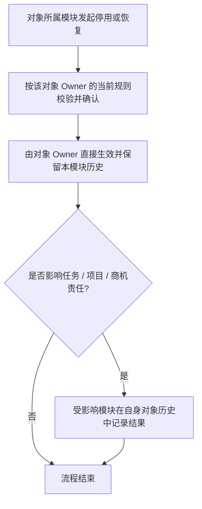

# FLOW-13 M05-deactivation-and-restore（已移除）

## REMOVED Current Boundary

原 M05 停用/恢复流程已被 `DEC-207` 替代，不再是 Current Product Flow。当前不提供 M05 菜单、页面、路由、权限节点、统一记录或恢复入口。

旧 `FLOW-13` 中由 M05 集中保存记录、提供详情或恢复入口的表达均为 `Historical / Replaced Evidence`。未来审批中心接入任一停用对象必须由该对象 Owner 另行评审。

精确依据：[`DEC-207《取消独立停用记录并由业务所有者保留历史》`](../../decisions/DEC-207-取消独立停用记录并由业务所有者保留历史.md) -> “决策”。
