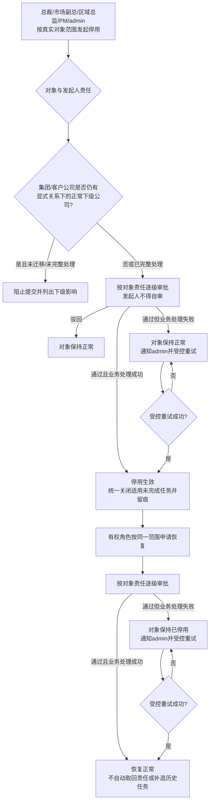
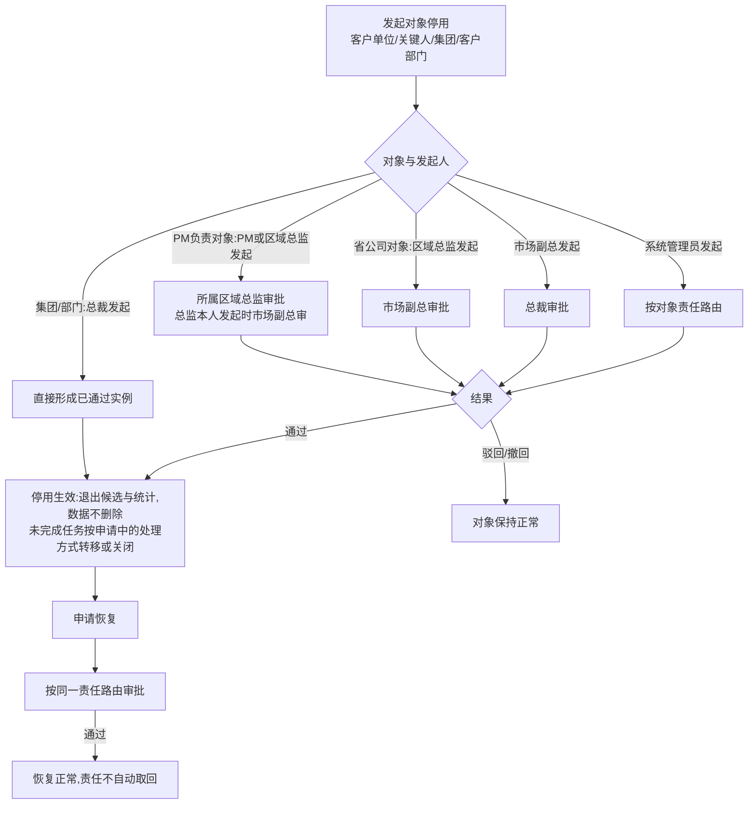

# FLOW-13 M05-deactivation-and-restore

- 原始行：2602
- 原始最近标题：F5 对象停用与恢复
- 迁移方式：Mermaid block mechanical copy
- 当前定位：Current Product Flow 使用下方 Current 分支；原机械迁移块保留为 Historical / Replaced Evidence（DEC-163）

## Current Product Flow

HR/人事没有客户侧停用/恢复发起权。客户公司下级只按显式组织上级识别；业务责任区域不用于推导级联关系。Current Rule 不提供通用任务转移、迁移或重新分配能力。业务页面始终只展示对象真实业务状态，不展示停用审批中/恢复审批中流程投影；任一受控重试成功前，同一对象不能重新发起停用或恢复，也不创建第二审批实例。

## Historical / Replaced Evidence

以下机械迁移块原样保留；其中“未完成任务按申请中的处理方式转移或关闭”已被 DEC-163 替代，不再作为 Current Rule。

