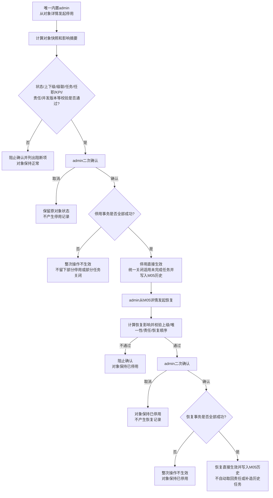
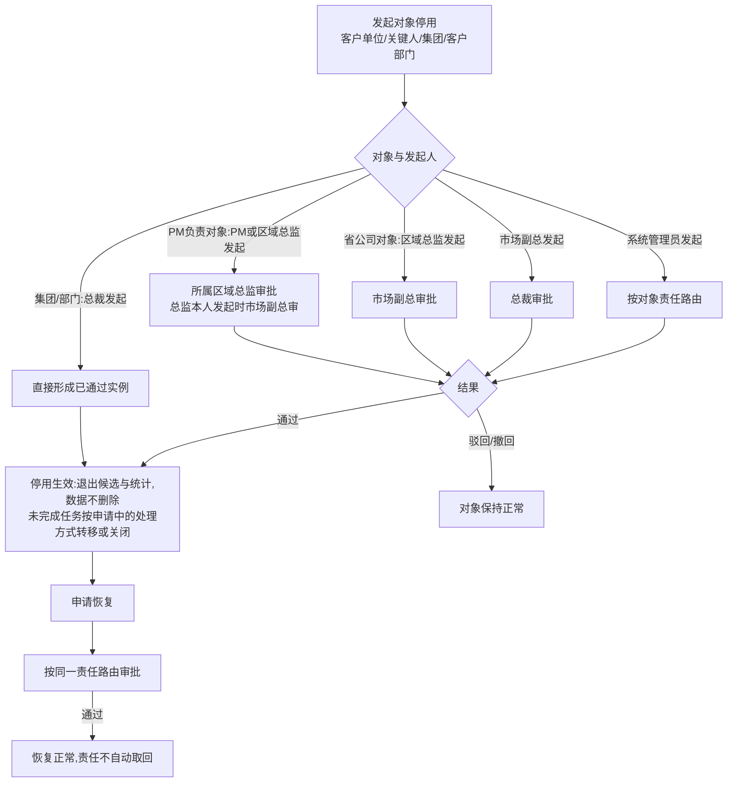

# FLOW-13 M05-deactivation-and-restore

- 原始行：2602
- 原始最近标题：F5 对象停用与恢复
- 迁移方式：Mermaid block mechanical copy
- 当前定位：Current Product Flow 使用下方 Current 分支；原机械迁移块保留为 Historical / Replaced Evidence（DEC-163、DEC-198）

## Current Product Flow

客户侧停用/恢复仅唯一内置 `admin` 可操作；总裁、市场副总、区域总监、PM、HR/人事及其他角色均无入口，直接请求返回 403 且不泄露对象信息。客户公司下级只按显式组织上级识别；业务责任区域不用于推导级联关系。Current Rule 不提供通用任务转移、迁移或重新分配能力，也不创建 M04 审批实例、审批节点、流程编号、审批待办、抄送或业务回调重试链路。任一写入失败时整次操作不生效，M05 仍保留成功操作的对象快照、影响结果、实际操作人、生效时间和完整历史。

## Historical / Replaced Evidence

以下机械迁移块原样保留；其中多角色发起、审批路由和流程编号已被 DEC-198 替代，“未完成任务按申请中的处理方式转移或关闭”已被 DEC-163 替代，均不再作为 Current Rule。

