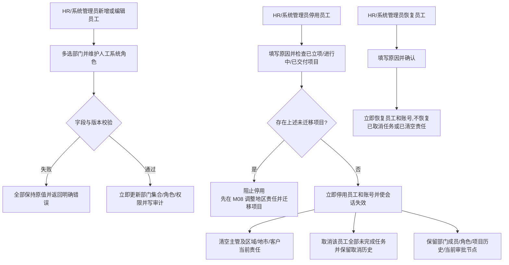

# FLOW-14 M06-employee-change-and-deactivation

- 原始行：2624
- 原始最近标题：F6 员工调岗/移动与停用/恢复
- 迁移方式：Mermaid block mechanical copy
- 当前定位：Current Product Flow；DEC-165/182/188/201 将员工组织变化统一为普通编辑直接生效，并将员工停用/恢复定义为 M06 直接状态操作；`已立项`、`进行中`或`已交付`项目必须先通过既有地区责任调整迁移，`已取消`和`已中止`不迁移且不阻断停用

> Historical / Replaced Evidence：旧图中的调岗影响/交接与员工停用/恢复主管审批、驳回、撤回、计划日期分支已由 DEC-165 替代；“停用后未完成任务继续保留原员工”已由 DEC-182 替代。关键人调岗、客户停用/恢复和其他 M04 流程不受影响。

> Current Boundary：当前不新增交接人字段或员工交接模块；项目连续性复用 M08 既有地区责任调整。`已立项`、`进行中`或`已交付`项目未迁移时阻止停用；`已完成`继续随既有责任迁移，`已取消`和`已中止`不迁移且不阻断停用。
