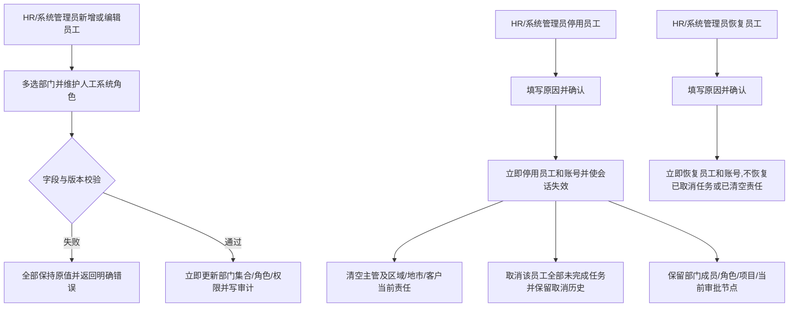

# FLOW-14 M06-employee-change-and-deactivation

- 原始行：2624
- 原始最近标题：F6 员工调岗/移动与停用/恢复
- 迁移方式：Mermaid block mechanical copy
- 当前定位：Current Product Flow；DEC-165/182 将员工组织变化统一为普通编辑直接生效，并将当前员工停用/恢复定义为 M06 直接状态操作

> Historical / Replaced Evidence：旧图中的调岗影响/交接与员工停用/恢复主管审批、驳回、撤回、计划日期分支已由 DEC-165 替代；“停用后未完成任务继续保留原员工”已由 DEC-182 替代。关键人调岗、客户停用/恢复和其他 M04 流程不受影响。

> Future Boundary：完整版本的员工停用必须选择交接人，完成适用责任、任务和项目交接并清除阻断；当前流程不展示交接人字段、不做该阻断校验。
