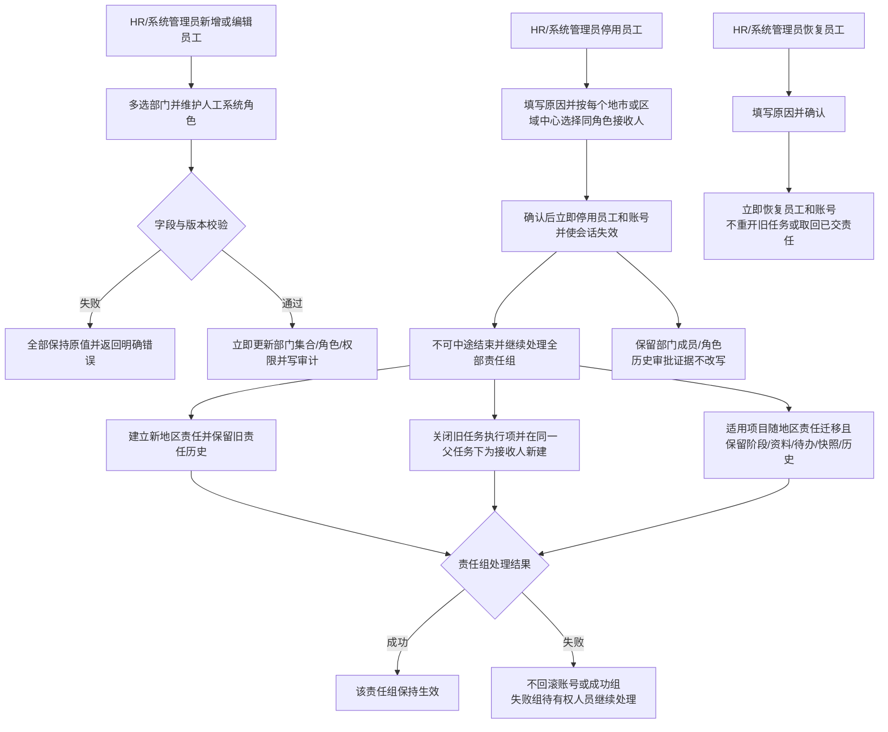

# FLOW-14 M06-employee-change-and-deactivation

- 原始行：2624
- 原始最近标题：F6 员工调岗/移动与停用/恢复
- 迁移方式：Mermaid block mechanical copy
- 当前定位：Current Product Flow；DEC-165/201/202/203 将员工组织变化统一为普通编辑直接生效，并将员工停用定义为账号先失效、再按 PM 地市或区域总监区域中心分组交接且不进入 M04 的 M06 直接操作

> Historical / Replaced Evidence：旧图中的调岗影响/交接与员工停用/恢复主管审批、驳回、撤回、计划日期分支已由 DEC-165 替代；“停用后未完成任务继续保留原员工”“全部未完成任务直接取消”及“先迁移项目再停用”已依次由 DEC-182/188/202 替代。关键人调岗及其他当前业务的人工审批均由 DEC-204 替代；历史审批证据仅只读保留，当前无 M04 查看或处理入口。客户侧停用/恢复已由 DEC-198/203 独立替代为 admin 直接生效且不进入 M04。

> Current Boundary：员工停用表单按已有地区责任分组选择接收人，但不新增独立交接模块、审批、编号或状态。项目负责人仍唯一随地区责任，不单独选择；`已立项`、`进行中`、`已交付`和`已完成`迁移，`已取消`和`已中止`不迁移。
