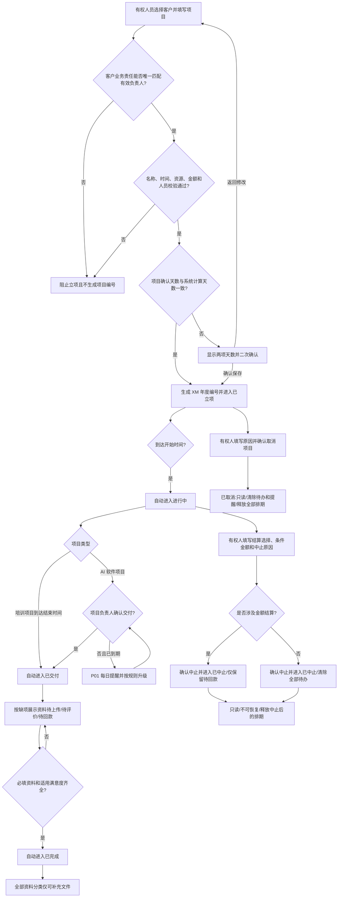

# FLOW-15 M11-project-lifecycle

- 当前定位：Current Product Flow
- 规则来源：M11、DEC-174、DEC-176、DEC-201

## 当前人工创建阶段

- 系统计算天数根据开始/结束时间按 M11 自然日规则生成，只读；项目确认天数默认同步，用户手工修改后不再被日期变化覆盖。
- 创建、开始前编辑和进行中修改结束时间时，两值不一致均显示`确认使用不同的项目天数`弹窗；正文分两行显示两项天数，`返回修改`不保存，`确认保存`才继续原流程。
- 培训项目金额按项目确认天数计算；AI 软件项目确认天数只记录周期，不参与项目金额计算。项目详情展示两项天数，项目列表只展示项目确认天数。

## 未来商机与合同能力上线后

普通人工创建入口关闭。只有合同审核并验证通过后，商机负责人可从商机点击`创建项目`；系统带出商机、合同、客户和按客户业务责任解析的项目负责人，补齐项目字段并通过同一立项校验后直接进入`已立项`，不增加项目立项审批。客户显式组织上级和组织路径不参与负责人解析。后续生命周期与上图一致。

`资料待上传`、`待评价`、`待回款`是可并行待办标识，不是主阶段。`待回款`当前不能解除，也不阻塞项目完成。仅已立项可取消，取消确认后直接生效；仅进行中可中止，中止确认后直接生效。当前不创建取消或中止审批，未来审批能力正式进入 Current 前不得显示为已有能力。

项目资料仅从`已交付`阶段开始维护：`已立项`和`进行中`只读且不允许新增、删除或替换，`已交付`删除文件前必须确认不可恢复，`已完成`可向项目类型已有的全部必填和可选资料分类补充文件但不能删除或替换已有资料，`已取消`和`已中止`完全只读。项目详情将`资料`与`满意度`作为两个独立 Tab；满意度仍仅在`已交付`阶段填写。
