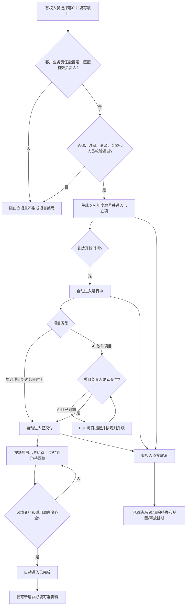

# FLOW-15 M11-project-lifecycle

- 当前定位：Current Product Flow
- 规则来源：M11、DEC-174、DEC-176

## 当前人工创建阶段

## 未来商机与合同能力上线后

普通人工创建入口关闭。只有合同审核并验证通过后，商机负责人可从商机点击`创建项目`；系统带出商机、合同、客户和按客户业务责任解析的项目负责人，补齐项目字段并通过同一立项校验后直接进入`已立项`，不增加项目立项审批。客户显式组织上级和组织路径不参与负责人解析。后续生命周期与上图一致。

`资料待上传`、`待评价`、`待回款`是可并行待办标识，不是主阶段。`待回款`当前不能解除，也不阻塞项目完成。当前取消直接生效；未来统一审批中心接管前不得显示为已有取消审批能力。
