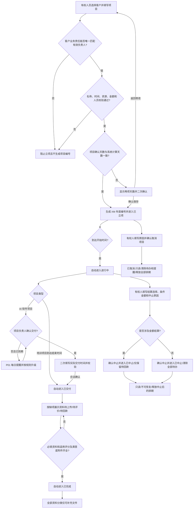

# FLOW-15 M11-project-lifecycle

- 当前定位：Current Product Flow
- 规则来源：M11、DEC-174、DEC-176、DEC-201、DEC-217、DEC-218

## 当前人工创建阶段

区域总监可在本人主管全部区域内选择省级、市级和区县级客户。为市级/区县级客户创建时，项目负责人自动匹配该客户当前有效地市PM，创建操作人为总监；提交时复核当前主管关系、创建权限和负责人，失效或越权拒绝，不任意指定PM。成功后直接进入项目详情，总监对PM项目只读，PM按既有阶段规则维护；该项目进入总监“全部项目”及PM本人项目，不因创建人身份进入总监“我的项目”。没有额外PM接收、审批或创建通知。

当前创建/编辑页及详情基本信息的“所属商机编号”只读显示“—”并旁注“暂不填写”，不提供商机关联入口，空值不影响项目操作。详细规则见 [`M11 项目管理`](../modules/M11-project-management.md) → §4.3、§4.4、§5.1；验收见 [`M11 Acceptance`](../acceptance/M11.md) → AC-M11-61至AC-M11-64。

```mermaid
flowchart TD
    A[有权人员选择客户并填写项目] --> B{客户业务责任能否唯一匹配有效负责人?}
    B -- 否 --> C[阻止立项且不生成项目编号]
    B -- 是 --> D{名称、时间、资源、金额和人员校验通过?}
    D -- 否 --> C
    D -- 是 --> D1{项目确认天数与系统计算天数一致?}
    D1 -- 是 --> E[生成 XM 年度编号并进入已立项]
    D1 -- 否 --> D2[显示两项天数并二次确认]
    D2 -- 返回修改 --> A
    D2 -- 确认保存 --> E
    E --> F{到达开始时间?}
    F -- 是 --> G[自动进入进行中]
    G --> H{项目类型}
    H -- 培训项目到达结束时间 --> I[自动进入已交付]
    H -- AI 软件项目 --> J{项目负责人确认交付?}
    J -- 否且已到期 --> K[P01 每日提醒并按规则升级]
    K --> J
    J -- 是 --> J1[二次填写实际交付时间并校验]
    J1 -- 合法确认 --> I
    I --> L[按缺项展示资料待上传/待评价/待回款]
    L --> M{必填资料和适用评分及满意度附件齐全?}
    M -- 否 --> L
    M -- 是 --> N[自动进入已完成]
    N --> O[全部资料分类仅可补充文件]
    E --> P[有权人填写原因并确认取消项目]
    P --> Q[已取消:只读/清除待办和提醒/释放全部排期]
    G --> R[有权人填写结算选择、条件金额和中止原因]
    R --> S{是否涉及金额结算?}
    S -- 是 --> T[确认中止并进入已中止/仅保留待回款]
    S -- 否 --> U[确认中止并进入已中止/清除全部待办]
    T --> V[只读/不可恢复/释放中止后的排期]
    U --> V
```

- 系统计算天数根据开始/结束时间按 M11 自然日规则生成，只读；项目确认天数默认同步，用户手工修改后不再被日期变化覆盖。
- 创建、开始前编辑和进行中修改结束时间时，两值不一致均显示`确认使用不同的项目天数`弹窗；正文分两行显示两项天数，`返回修改`不保存，`确认保存`才继续原流程。
- 培训项目金额按项目确认天数计算；AI 软件项目确认天数只记录周期，不参与项目金额计算。项目详情展示两项天数，项目列表只展示项目确认天数。

培训项目当前自动完成所需满意度包括项目、主讲师及已选择的辅讲师评分，以及至少一份项目级满意度附件；助教不评价，缺少助教评分不产生`待评价`或阻止完成。详见 `prd-workspace/current/modules/M11-project-management.md` → §12.4“满意度”、`prd-workspace/current/acceptance/M11.md` → AC-M11-23。

## 未来商机与合同能力上线后

普通人工创建入口关闭。只有合同审核并验证通过后，商机负责人可从商机点击`创建项目`；系统带出商机、合同、客户和按客户业务责任解析的项目负责人，补齐项目字段并通过同一立项校验后直接进入`已立项`，不增加项目立项审批。客户显式组织上级和组织路径不参与负责人解析。后续生命周期与上图一致。

`资料待上传`、`待评价`、`待回款`是可并行待办标识，不是主阶段。`待回款`当前不能解除，也不阻塞项目完成。仅已立项可取消，取消确认后直接生效；仅进行中可中止，中止确认后直接生效。当前不创建取消或中止审批，未来审批能力正式进入 Current 前不得显示为已有能力。

项目资料仅从`已交付`阶段开始维护：`已立项`和`进行中`只读且不允许新增、删除或替换，`已交付`删除文件前必须确认不可恢复，`已完成`可向项目类型已有的全部必填和可选资料分类补充文件但不能删除或替换已有资料，`已取消`和`已中止`完全只读。项目详情将`资料`与`满意度`作为两个独立 Tab；满意度仍仅在`已交付`阶段填写。

2026-10-09：实际交付时间独立记录，不覆盖原结束时间/天数/金额，历史业务生效时间仍为操作成功时间；历史已完成项目不因新附件要求退回。完整边界见 M11 §10.1.1、§12.5 和 AC-M11-66/67。
