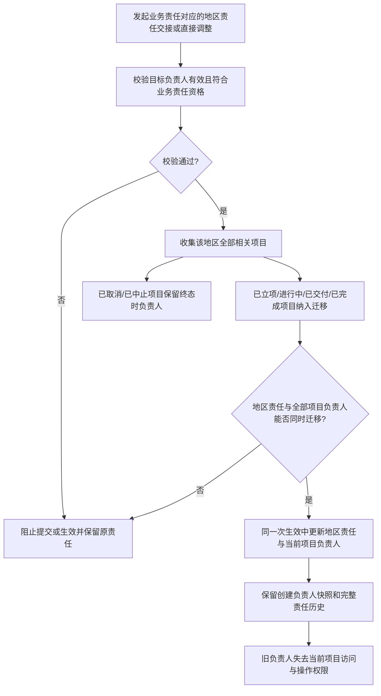

# FLOW-16 M11-project-responsibility-handover

- 当前定位：Current Product Flow
- 规则来源：M08、M11、DEC-175、DEC-188、DEC-201、DEC-202

- 不允许单个项目脱离客户业务责任对应的地区责任单独转交；客户显式组织上级调整不触发项目负责人迁移。
- 地区责任交接后的新负责人继承当前项目操作，以及已完成项目向全部已有资料分类补充文件的能力。
- 上图是普通地区责任交接/直接调整流程，继续保持地区责任与全部适用项目整体原子生效。
- 员工停用使用 DEC-202 的限定例外：M06 先停用员工和账号，再按 PM 地市或区域总监区域中心选择责任接收人；`已立项`、`进行中`、`已交付`和`已完成`项目随责任组迁移，`已取消`和`已中止`不迁移。成功组不因其他组失败而回滚，失败组待有权人员继续处理。
- 不允许在项目上独立选择停用接收人，不新增单项目转交、员工交接模块、交接状态或独立项目迁移审批；项目保留且不因员工停用自动取消或中止。
