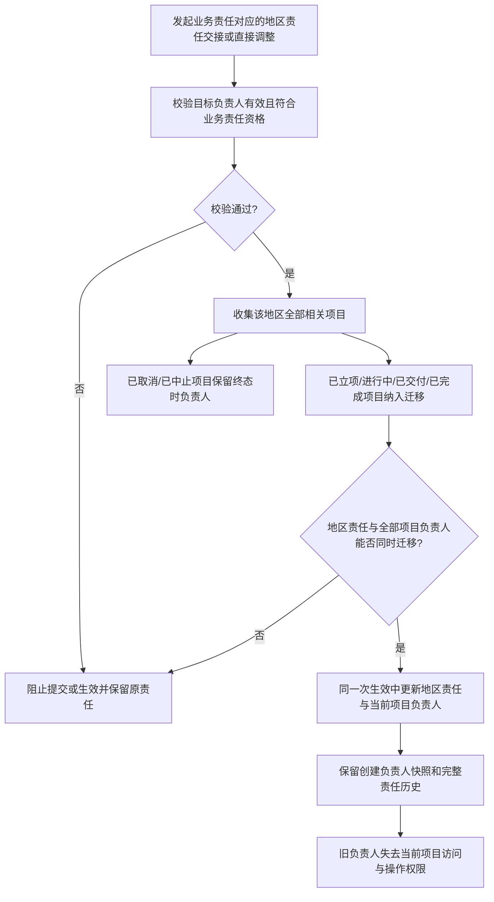

# FLOW-16 M11-project-responsibility-handover

- 当前定位：Current Product Flow
- 规则来源：M08、M11、DEC-175、DEC-188、DEC-201

- 不允许单个项目脱离客户业务责任对应的地区责任单独转交；客户显式组织上级调整不触发项目负责人迁移。
- 地区责任交接后的新负责人继承当前项目操作，以及已完成项目向全部已有资料分类补充文件的能力。
- 本流程同时作为员工停用前项目连续性的既有迁移入口：存在已立项、进行中或已交付项目时，先通过地区责任直接调整完成适用项目负责人迁移，再允许 M06 停用；已取消和已中止不迁移且不构成停用阻断。
- 不新增员工交接人字段、单项目转交或独立项目迁移审批；项目保留且不因员工停用自动取消。
