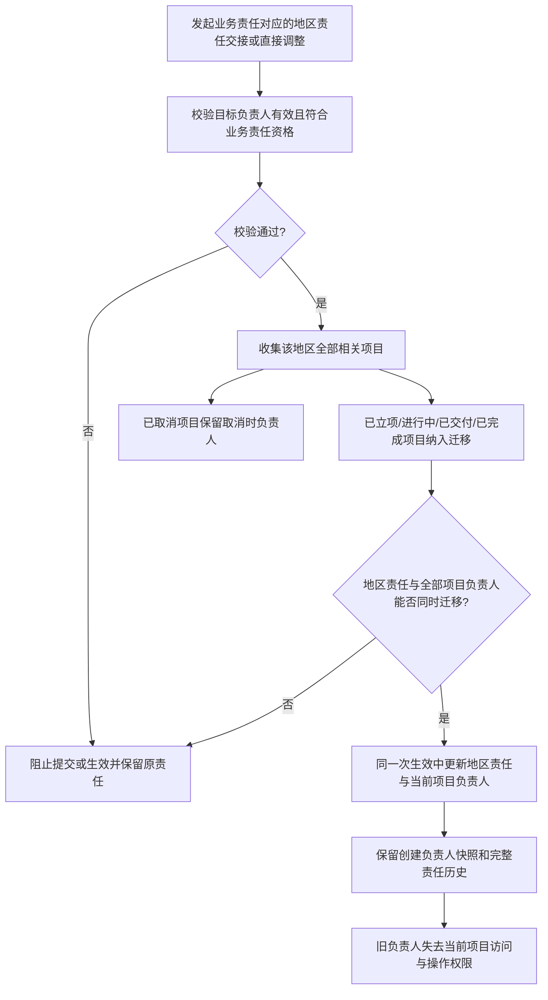

# FLOW-16 M11-project-responsibility-handover

- 当前定位：Current Product Flow
- 规则来源：M08、M11、DEC-175

- 不允许单个项目脱离客户业务责任对应的地区责任单独转交；客户显式组织上级调整不触发项目负责人迁移。
- 地区责任交接后的新负责人继承当前项目操作，以及已完成项目新增非必填可选资料的能力。
- 本流程只约束主动地区交接或直接调整。当前员工停用按 DEC-182 不选择交接人、不以项目迁移为前置阻断，项目保留且不自动取消或迁移。
- 完整版本才要求停用时选择交接人并完成适用项目交接；该能力不属于当前流程。
