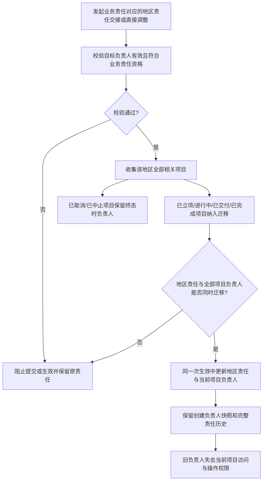

# FLOW-16 M11-project-responsibility-handover

- 当前定位：Current Product Flow
- 规则来源：M08、M11、DEC-175、DEC-188、DEC-201、DEC-202

平台师资合作项目先读取末尾“生态合作员分支”，下面地区责任图只适用于其他项目。

```mermaid
flowchart TD
    A[发起业务责任对应的地区责任交接或直接调整] --> B[校验目标负责人有效且符合业务责任资格]
    B --> C{校验通过?}
    C -- 否 --> D[阻止提交或生效并保留原责任]
    C -- 是 --> E[收集该地区全部相关项目]
    E --> F[已立项/进行中/已交付/已完成项目纳入迁移]
    E --> G[已取消/已中止项目保留终态时负责人]
    F --> H{地区责任与全部项目负责人能否同时迁移?}
    H -- 否 --> D
    H -- 是 --> I[同一次生效中更新地区责任与当前项目负责人]
    I --> J[保留创建负责人快照和完整责任历史]
    J --> K[旧负责人失去当前项目访问与操作权限]
```

- 不允许单个项目脱离客户业务责任对应的地区责任单独转交；客户显式组织上级调整不触发项目负责人迁移。
- 地区责任交接后的新负责人继承当前项目操作，以及已完成项目向全部已有资料分类补充文件的能力。
- 上图是普通地区责任交接/直接调整流程，继续保持地区责任与全部适用项目整体原子生效。
- 员工停用使用 DEC-202 的限定例外：M06 先停用员工和账号，再按 PM 地市或区域总监区域中心选择责任接收人；`已立项`、`进行中`、`已交付`和`已完成`项目随责任组迁移，`已取消`和`已中止`不迁移。成功组不因其他组失败而回滚，失败组待有权人员继续处理。
- 不允许在项目上独立选择停用接收人，不新增单项目转交、员工交接模块、交接状态或独立项目迁移审批；项目保留且不因员工停用自动取消或中止。

## 生态合作员分支（DEC-220）

有效生态合作员选择全国正常客户及平台师资合作资源 → 本人为负责人；admin代立先选择有效生态合作员 → 保存后本人维护原项目阶段。PM/总监不创建、不查看、不计入区域统计；项目不随地区交接迁移。所属商机编号仍只读留空。

HR/admin在原员工编辑/停用入口提出撤销角色或停用 → 收集已立项/进行中/已交付/已完成的本人平台项目 → 如有项目选择另一有效生态合作员 → 提交复核全部候选与项目集合 → 失败保持原员工、角色与项目 → 全部交接成功并保留快照/责任历史 → 再移除角色或停用。已取消/已中止不迁移；恢复不取回。完整来源：`prd-workspace/current/modules/M11-project-management.md` §5.5/§14.3、`prd-workspace/current/modules/M06-organization.md`“生态合作员角色维护与项目交接”。
