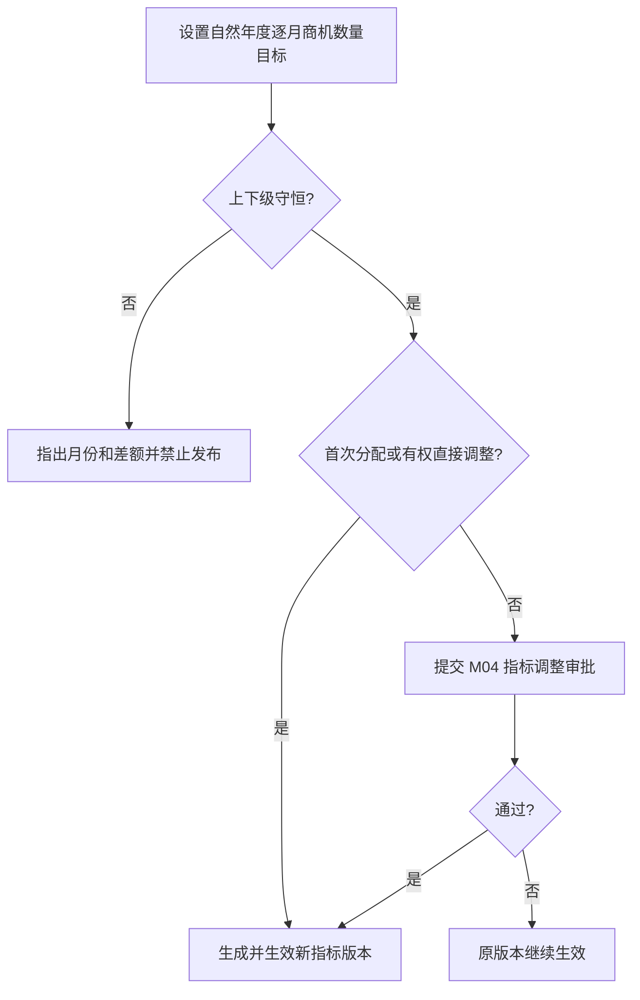
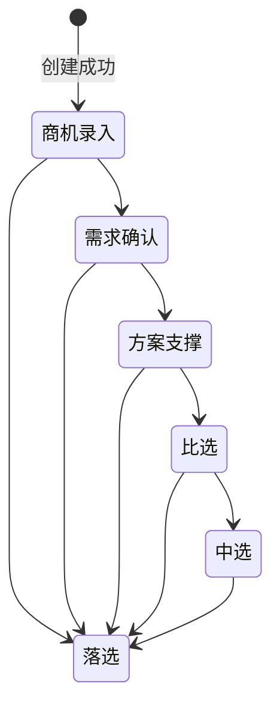
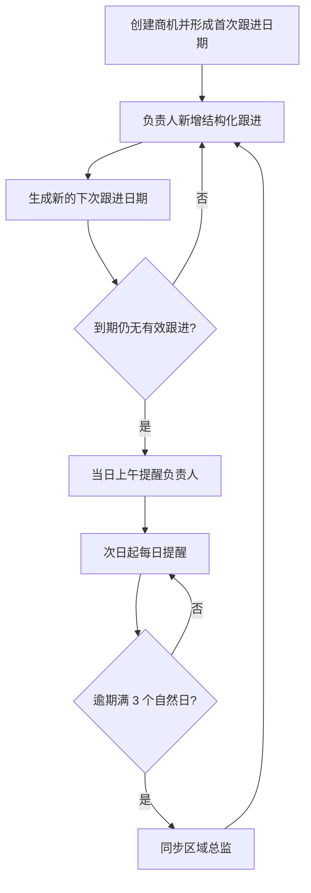

# FLOW-17：M12 销售与商机管理

- 状态：Current
- Owner：M12
- Decision：DEC-068、DEC-070、DEC-072、DEC-074、DEC-075、DEC-081、DEC-194

## 销售指标

首次区域分配由市场副总完成，首次 PM 分配由区域总监完成；总裁和系统管理员可覆盖管理。已发布版本的非直接调整按 M12 路由进入 M04，目标事实和生效结果仍归 M12。

## 商机主流程

- “线索”只描述商机录入、需求确认等早期商机，不是独立对象或状态。
- 仅当前负责人可正常推进；区域总监先合法改派，再由新负责人继续。
- 进入中选填写中选日期和预计签约金额；中选仍允许跟进。
- 进入落选填写落选原因、竞争对手和复盘说明；落选后停止推进和新增跟进。
- 当前 M12 不进入已签约；合同与财务能力须由未来独立 Current 产品链接管。

## 跟进与方案支撑

方案支撑由商机负责人向一人或多人发起；每名支撑人员独立经历待响应、已响应、支撑中、已交付、已关闭。首次回应超时只产生 P01 消息，不改变商机阶段或自动改派。

## 失败保护

- 必填缺失、范围变化、关键人失效或非法阶段请求不改变当前事实。
- 并发阶段请求只有基于最新版本的合法请求生效。
- 指标审批驳回不覆盖最近生效版本。
- 消息失败不回滚商机、跟进或支撑事实。
- 越权访问统一返回 403 且不泄露对象是否存在。
