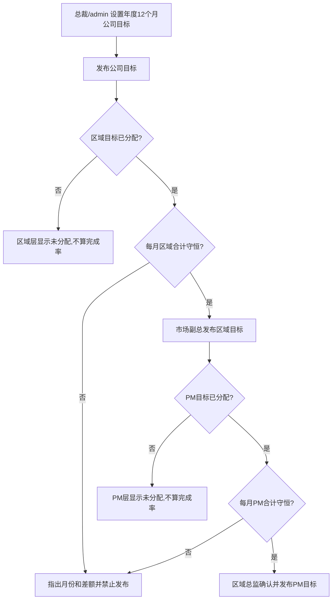
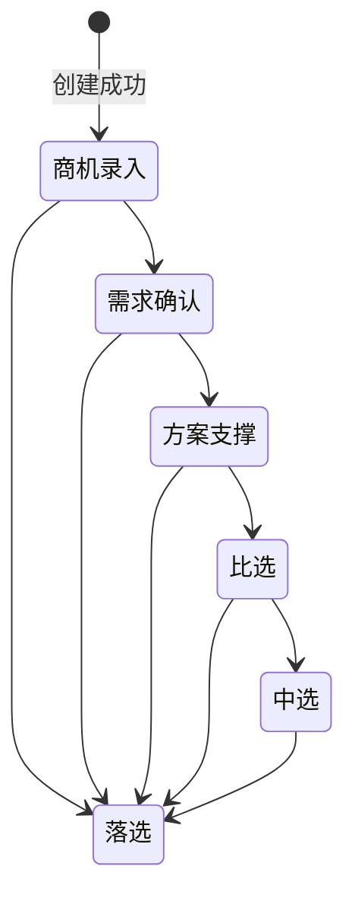
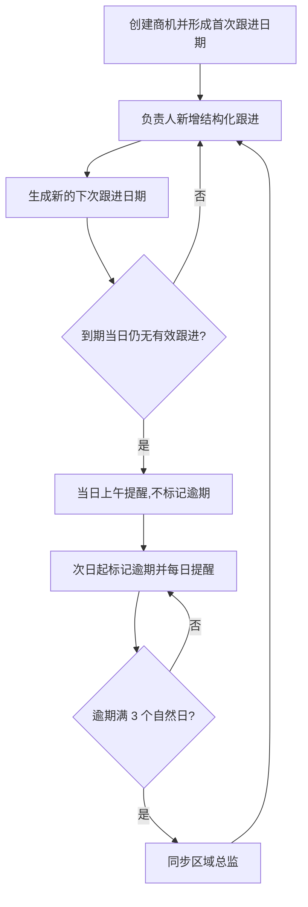
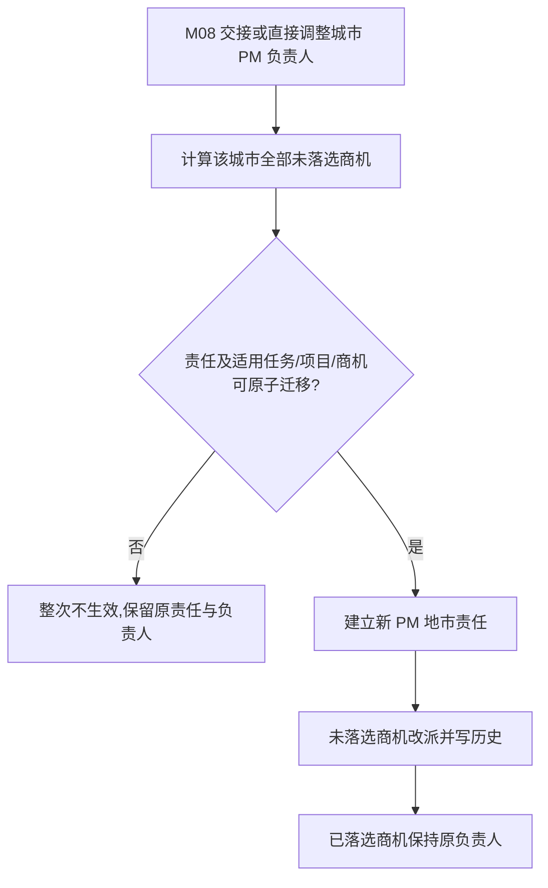

# FLOW-17：M12 销售与商机管理

- 状态：Current
- Owner：M12
- Decision：DEC-081、DEC-194、DEC-204、DEC-209（替代 DEC-206/208 的角色与地市责任部分）

## 销售目标建立

总裁和系统管理员可覆盖管理。上级目标可先发布，下级未分配不阻断上级生效。已发布版本调整继续按原角色层级、当前月/未来月和上下级守恒规则，由 M12 校验并在二次确认后直接形成新生效版本，不进入 M04。目标按 PM 员工 ID 归属，同一员工只计一次。

## 商机创建、编辑与推进

- “线索”只描述商机录入、需求确认等早期商机，不是独立对象或状态。
- 商机负责人按客户业务责任自动匹配并只读：市/区县客户匹配唯一地市 PM 负责人，省级客户匹配当前区域总监；无唯一有效匹配时阻止创建。
- PM 只可按本人当前 PM 责任地市创建本人负责商机；区域总监可创建并直接推进本人主管区域的省级商机，监管的其他商机须先合法改派给新负责人。
- 商机关键人从所选客户当前有效关键人中至少 1 人可搜索多选，保存时重新校验。
- 落选前仅允许编辑已确认字段；客户单位、商机类型不可改，负责人只经改派变化；中选后预估金额只读。成功编辑写入变更历史并更新最近更新时间。
- 进入中选填写中选日期和`预计签约金额（含税，元）`；中选仍允许跟进。
- 进入落选填写落选原因、竞争对手和复盘说明；落选后停止推进和新增跟进。
- 当前 M12 不进入已签约；合同与财务能力须由未来独立 Current 产品链接管。

## 跟进

## 方案支撑

方案支撑由商机负责人向一名或多名在职 PM发起，按员工 ID 去重；每次必须填写支撑需求和回应时限，每名支撑人员独立经历待响应、已响应、支撑中、已交付、已关闭。被指派人从`我的方案支撑`处理本人请求，只看到必要商机与客户信息；admin 从`方案支撑管理`查看公司全量并以真实身份代操作，但不作为候选或受理人。首次回应超时只产生 P01 消息，不改变商机阶段或自动改派。

## 销售指标查看

- PM通过`我的销售指标`只读查看本人月度目标、完成、差额、完成率和本人调整历史；不查看公司、其他区域或其他PM目标。
- PM 默认模板提供本人销售指标入口，按稳定员工 ID 展示一次。

## PM 地市责任变化

## 失败保护

- 必填缺失、范围变化、关键人失效或非法阶段请求不改变当前事实。
- 并发阶段请求只有基于最新版本的合法请求生效。
- 指标校验、权限或并发失败不覆盖最近生效版本。
- 消息失败不回滚商机、跟进或支撑事实。
- 越权访问统一返回 403 且不泄露对象是否存在。
